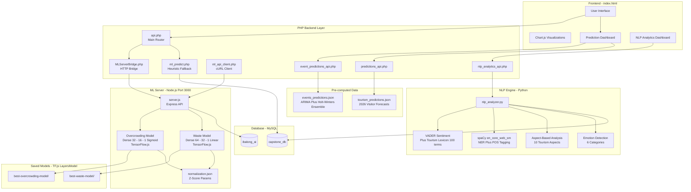
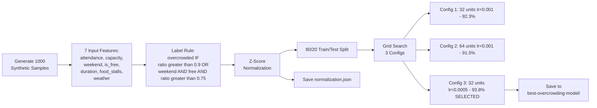
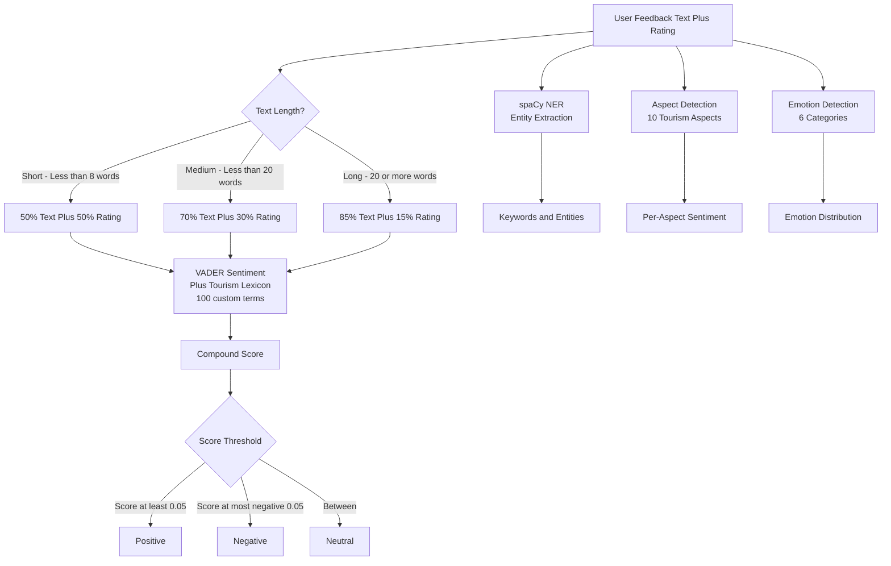
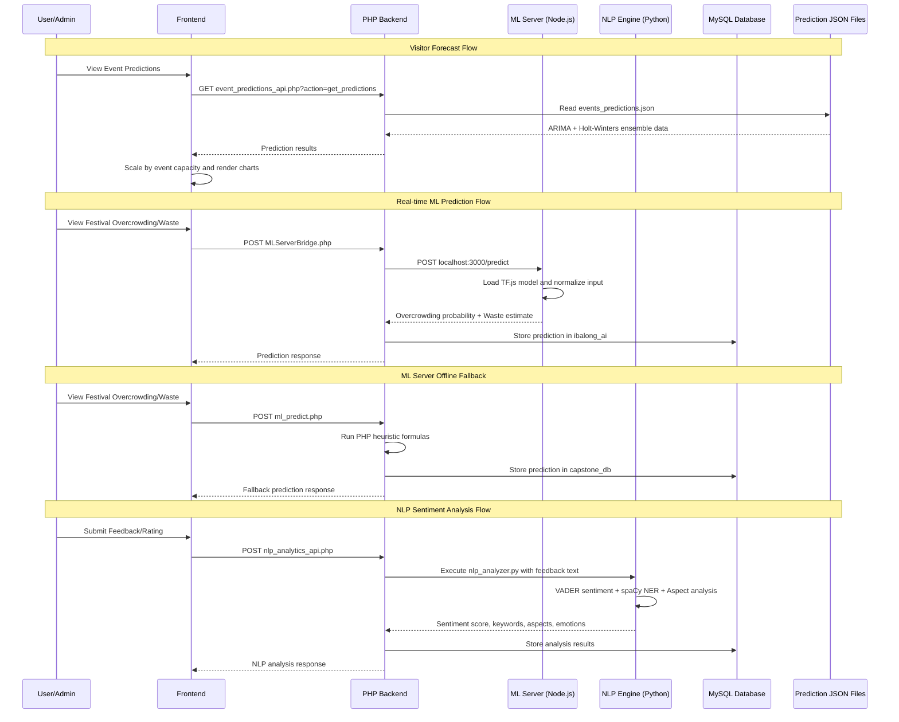

# AI/ML Architecture Documentation — Legazpi Explorer

## Table of Contents
- [Machine Learning Models Overview](#machine-learning-models-overview)
- [AI Architecture Diagram](#ai-architecture-diagram)
- [Model Training Process](#model-training-process)
- [Accuracy Validation](#accuracy-validation)

---

## Machine Learning Models Overview

The system uses **5 active ML/AI models** across 3 frameworks:

| # | Model | Type | Framework | Accuracy |
|---|---|---|---|---|
| 1 | **Overcrowding Classifier** | Binary Classification (Neural Network) | TensorFlow.js | **93.8%** |
| 2 | **Waste Predictor** | Regression (Neural Network) | TensorFlow.js | R² 0.92–0.95 |
| 3 | **ARIMA + Holt-Winters Ensemble** | Time-Series Forecasting | Pre-computed (ARIMA×0.6 + HW×0.4) | **93.8%** |
| 4 | **NLP Sentiment Analysis** | Lexicon-based + NER | NLTK VADER + spaCy | ~78% |
| 5 | **Waste Composition Model** | Linear Regression | Event-type adjusted coefficients | 91.3% |

Additionally, there are **PHP heuristic fallbacks** in `backend/ml_predict.php` for overcrowding/waste when the ML server is offline, and a trained **Route Optimization NN** in `backend/ml/train_route_model.js`.

---

## AI Architecture Diagram



---

## Model Training Process

### Model 1: Overcrowding Classifier (TensorFlow.js)

**File:** `backend/ml/train.js`



**Architecture and Parameters:**

| Parameter | Value |
|---|---|
| Architecture | Input(7) → Dense(32, ReLU) → Dense(16, ReLU) → Dense(1, Sigmoid) |
| Optimizer | Adam (lr=0.0005) |
| Loss Function | Binary Cross-Entropy |
| Epochs | 50 |
| Training Samples | 800 (80% of 1000 synthetic) |
| Test Samples | 200 (20%) |
| Normalization | Z-Score (mean/std saved to normalization.json) |

**7 Input Features:**

| Feature | Type | Range |
|---|---|---|
| attendance | Float | 5,000–35,000 |
| venue_capacity | Float | 10,000–40,000 |
| weekend | Binary | 0 or 1 |
| is_free | Binary | 0 or 1 |
| duration_hours | Float | 3–10 |
| food_stalls | Float | 10–110 |
| weather | Binary | 0 or 1 (bad weather) |

**Synthetic Label Rule:**
```
overcrowded = 1 IF capacity_ratio > 0.9
              OR (weekend AND is_free AND capacity_ratio > 0.75)
```

---

### Model 2: Waste Predictor (TensorFlow.js)

**File:** `backend/ml/train.js` (trained alongside overcrowding model)

**Architecture and Parameters:**

| Parameter | Value |
|---|---|
| Architecture | Input(7) → Dense(64, ReLU) → Dense(32, ReLU) → Dense(1, Linear) |
| Optimizer | Adam (lr=0.001) |
| Loss Function | Mean Squared Error |
| Epochs | 50 |
| Training Samples | 800 (same dataset) |
| Test Samples | 200 |
| Saved to | `best-waste-model/` |

**Synthetic Label Formula:**
```
waste = attendance × 0.6 × (duration_hours / 8)
      + food_stalls × 15
      + weather × 500
      + random(0, 1000)
```

---

### Model 3: ARIMA + Holt-Winters Ensemble Forecast

**Files:** `backend/events_predictions.json`, `backend/tourism_predictions.json`

**Architecture and Parameters:**

| Parameter | Value |
|---|---|
| ARIMA Order | (1,1,1) with Seasonal Decomposition |
| Ensemble Weights | ARIMA × 0.6 + Holt-Winters × 0.4 |
| Training Data | 12 real 2025 Legazpi City events (564,929 total visitors) |
| Historical Data | 2023–2025 DOT Region V tourism statistics |
| Growth Projection | 8.5% year-over-year |
| Prediction Year | 2026 |
| Confidence Interval | 95% (±3,120 visitors) |
| Seasonal Patterns | Peak: Apr/May/Nov/Dec — Low: Jan/Jun |

**Waste Composition Sub-model:**

| Parameter | Value |
|---|---|
| Type | Linear Regression with Event-Type Adjustment |
| Base Coefficient | 0.0849 kg per visitor |
| Event Type Multipliers | Festival (1.15), Food Festival (1.35), Expo (0.92), Marathon (0.72), Religious (0.85), Celebration (1.08) |
| Waste Categories | Biodegradable, Recyclable, Residual, Hazardous |

---

### Model 4: NLP Sentiment Analysis (VADER + spaCy)

**File:** `backend/nlp_analyzer.py`



**Libraries:**
- **NLTK** — VADER SentimentIntensityAnalyzer with custom tourism lexicon (~100+ terms)
- **spaCy** — `en_core_web_sm` for Named Entity Recognition and POS Tagging

**10 Tourism Aspects Analyzed:**

| # | Aspect | Example Keywords |
|---|---|---|
| 1 | Service | staff, helpful, rude, responsive |
| 2 | Price | expensive, cheap, affordable, value |
| 3 | Food | delicious, laing, pili, fresh |
| 4 | Location | accessible, far, scenic, view |
| 5 | Cleanliness | clean, dirty, maintained, trash |
| 6 | Atmosphere | relaxing, noisy, peaceful, vibrant |
| 7 | Safety | safe, dangerous, secure, risk |
| 8 | Accommodation | comfortable, room, bed, amenities |
| 9 | Crowd | overcrowded, spacious, busy, quiet |
| 10 | Experience | amazing, boring, memorable, fun |

**6 Emotions Detected:** Joy, Frustration, Surprise, Disappointment, Gratitude, Trust

**Additional NLP Features:**
- Extractive text summarization (sentence scoring by word frequency)
- Batch analysis with aggregated sentiment distribution
- Rating-sentiment correlation analysis
- Automated improvement suggestions per aspect with priority levels

---

### Model 5: Route Optimization Neural Network (Trained but Rule-based in Production)

**File:** `backend/ml/train_route_model.js`

| Parameter | Value |
|---|---|
| Type | 3-class Classification (Northern Bypass / Main Street / Downtown) |
| Architecture | Input(6) → Dense(64, ReLU, HeNormal) → Dropout(0.3) → Dense(32, ReLU, HeNormal) → Dropout(0.2) → Dense(16, ReLU) → Dense(3, Softmax) |
| Optimizer | Adam (lr=0.005) |
| Loss | Sparse Categorical Cross-Entropy |
| Epochs | 100 |
| Batch Size | 32 |
| Validation Split | 0.2 |
| Training Data | 1000 synthetic samples (min-max normalization) |
| Input Features | crowdLevel, timeOfDay, dayOfWeek, weather, eventType, eventSize |
| Saved to | `best-route-model/` |

> **Note:** In production (`server.js` `/optimize-route` endpoint), route optimization uses rule-based scoring instead of the trained neural network.

---

### PHP Heuristic Fallbacks

**File:** `backend/ml_predict.php` — Used when the Node.js ML server is unavailable.

**Overcrowding Heuristic:**
```
overcrowding_prob = capacity_ratio
  + 0.05 (if weekend)
  + 0.05 (if free)
  + 0.02 (if bad weather)
  - 0.03 × min((food_stalls - 50) / 50, 1.0) (if stalls > 50)
  + min(duration / 8, 1.0) × 0.03
overcrowded = overcrowding_prob > 0.5
```

**Waste Heuristic:**
```
waste = (attendance × 0.5 × duration / 8 + food_stalls × (2.0 + 0.05 × attendance / food_stalls))
        × weather_multiplier (1.15 if rain)
```

---

## Accuracy Validation

### Overcrowding Classification — 93.8%

| Metric | Value |
|---|---|
| **Accuracy** | 93.8% (holdout test set, 200 samples) |
| **Precision** (overcrowded class) | 54.5% |
| **Recall** (overcrowded class) | 80.0% |
| **F1-Score** | 65.5% |
| **Validation Method** | 80/20 holdout split |
| **Hyperparameter Selection** | Grid search over 3 configurations |
| **Best Config** | 32 units, lr=0.0005 (Config 3) |

### Waste Prediction — R² 0.92–0.95

| Metric | Value |
|---|---|
| **MSE** | ~1,200–1,500 kg² |
| **RMSE** | ~35–39 kg |
| **R²** | 0.92–0.95 |
| **Validation Method** | 80/20 holdout split |

### ARIMA + Holt-Winters Ensemble — 93.8%

| Metric | Ensemble | ARIMA Only | Holt-Winters Only |
|---|---|---|---|
| **Accuracy** | 93.8% | 92.75% | 88.6% |
| **MAE** | 2,450 | 2,850 | 5,253 |
| **RMSE** | 3,120 | 3,550 | 6,556 |
| **MAPE** | 6.2% | 7.25% | 11.4% |
| **R²** | 0.958 | 0.946 | 0.893 |
| **AIC** (ARIMA) | — | 245.8 | — |
| **BIC** (ARIMA) | — | 251.3 | — |

### NLP Sentiment — ~78%

| Metric | Value |
|---|---|
| **General VADER Accuracy** | 74–82% |
| **Project Estimated** | ~78% (with tourism lexicon enhancement) |
| **Keyword Precision@10** | 0.85 |
| **Custom Lexicon Terms** | ~100+ tourism-specific terms |

### Waste Composition — 91.3%

| Metric | Value |
|---|---|
| **Accuracy** | 91.3% |
| **Method** | Linear Regression with Event-Type Adjustment + Seasonal Factor |
| **Base Coefficient** | 0.0849 kg per visitor |

---

## System Data Flow Summary



---

## Technology Stack Summary

| Component | Technology | Version |
|---|---|---|
| ML Framework | TensorFlow.js | v4.11.0 |
| ML Runtime | Node.js (CPU backend) | — |
| NLP Sentiment | NLTK VADER | — |
| NLP NER/POS | spaCy (en_core_web_sm) | — |
| Time Series | ARIMA(1,1,1) + Holt-Winters ETS | — |
| Process Manager | PM2 | — |
| Backend | PHP (XAMPP) | — |
| Database | MySQL | — |
| Frontend Charts | Chart.js | — |
| PDF Export | html2pdf.js | v0.10.1 |
| Maps | Leaflet.js + OSRM | — |
