# System Documentation with Detailed Mermaid Diagrams

---

## 1. Use Case Diagram

```mermaid
usecaseDiagram
actor Admin
actor Guest

Admin --> (View Dashboard & Analytics)
Admin --> (Manage Destinations)
Admin --> (Manage Shops)
Admin --> (Manage Hotels)
Admin --> (Moderate Ratings & Reviews)
Admin --> (Export Reports)
Admin --> (Receive System Alerts)

Guest --> (Browse Destination Map)
Guest --> (View Destination Details)
Guest --> (View Visitor Predictions)
Guest --> (View Waste Insights)
Guest --> (Browse Novelty Shops)
Guest --> (View Shop Details)
Guest --> (Rate & Review Shops)
Guest --> (Plan Custom Itinerary)
Guest --> (Save/Share Itinerary)
Guest --> (Rate & Review System)
```

---

## 2. Class Diagram (High-level, Detailed)

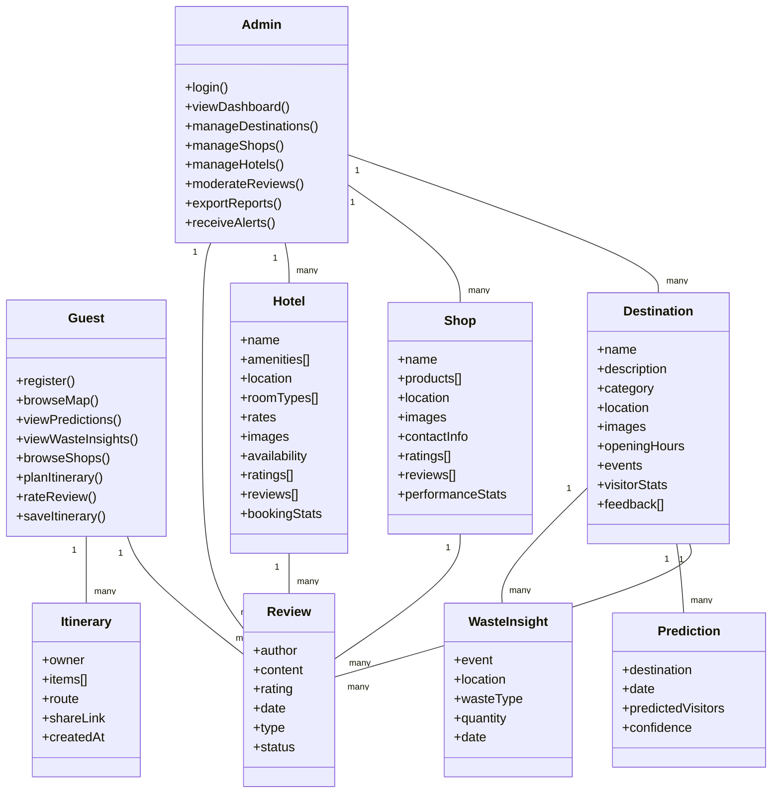

---

## 3. Sequence Diagram (Guest Planning and Saving Itinerary)


### Admin Side Sequence Diagrams

#### 1. Dashboard - Metrics
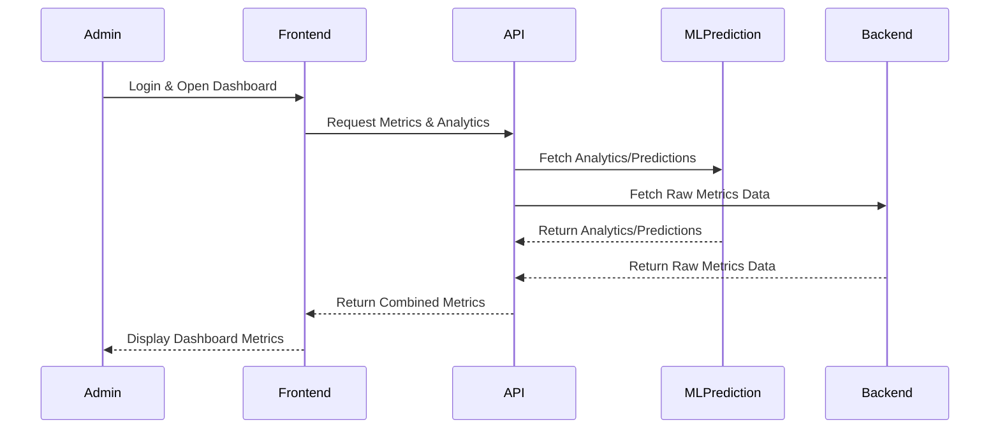

#### 2. Destination Management
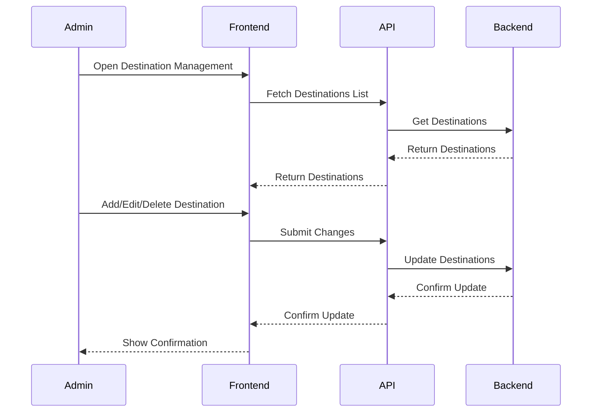

#### 3. Shop Management
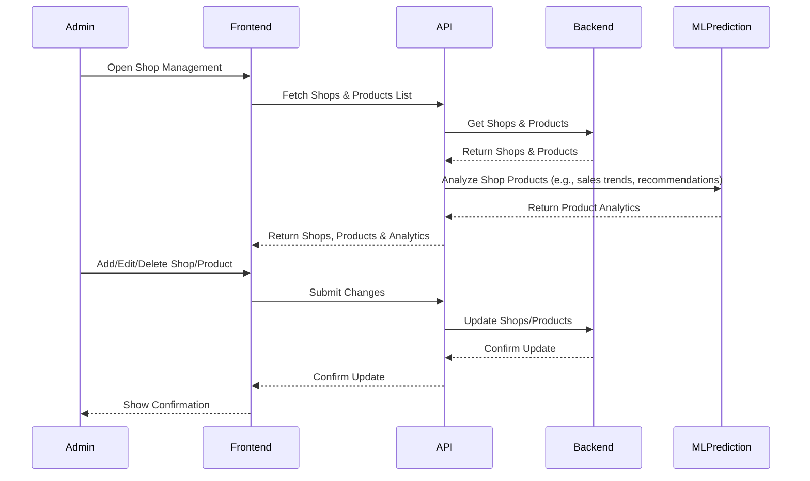

#### 4. Hotel Management
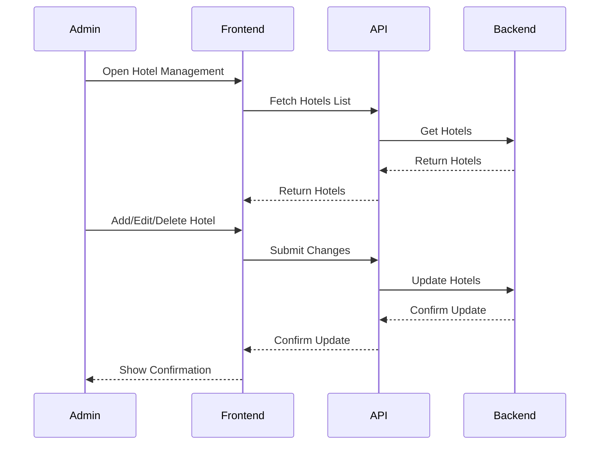

#### 5. Guest Ratings & Reviews Moderation
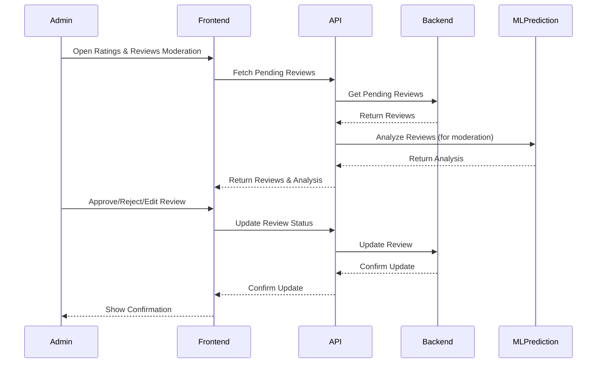

---

### Guest Side Sequence Diagrams

#### 1. Legazpi Destination Map
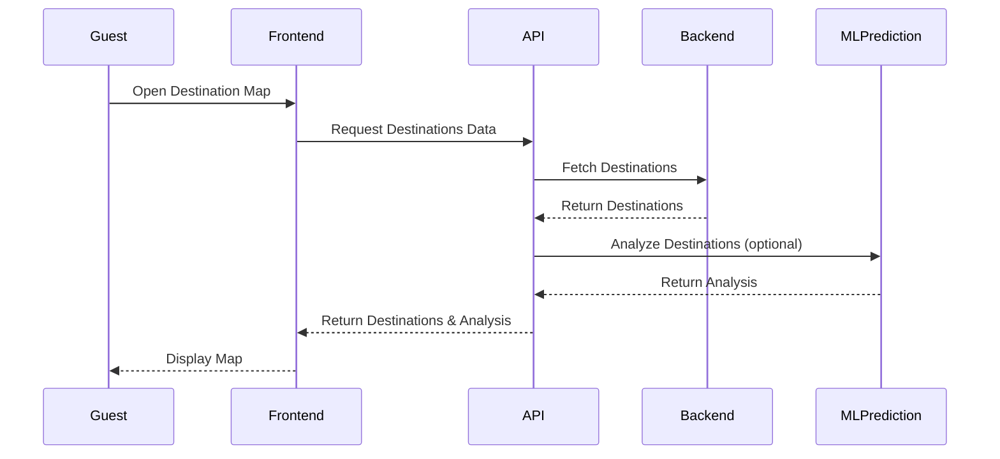

#### 2. Visitor Predictions
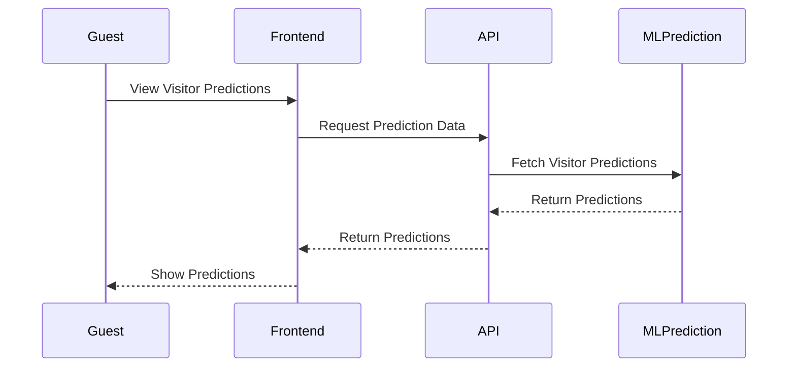

#### 3. Waste Breakdown
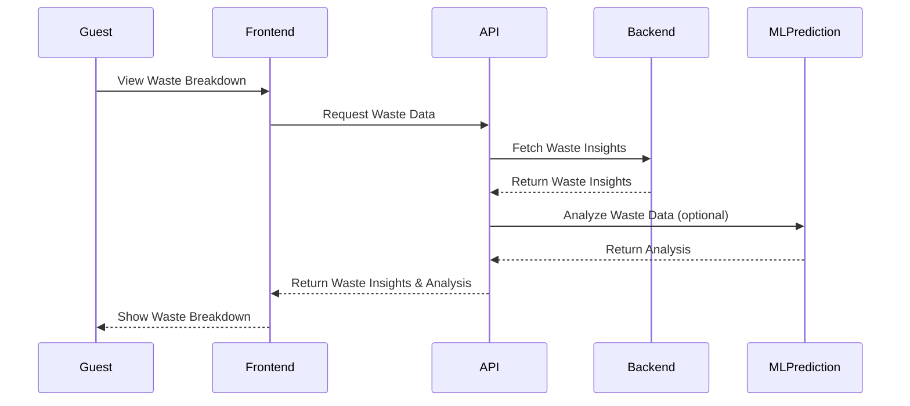

#### 4. Novelty Shops
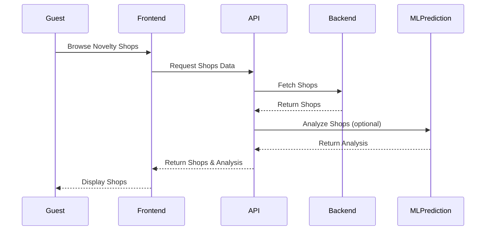

#### 5. Custom Itinerary
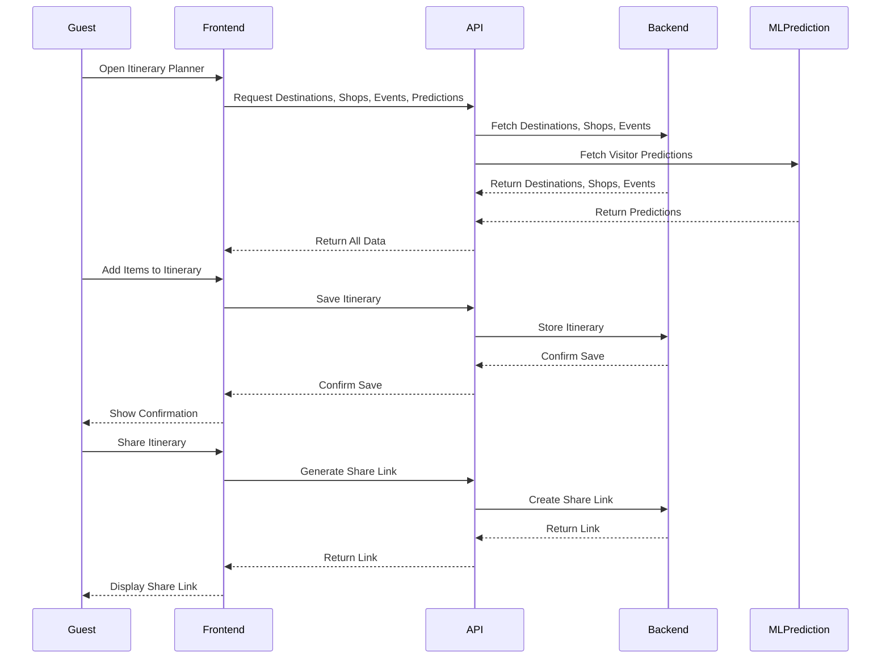

#### 6. Rate & Review the System
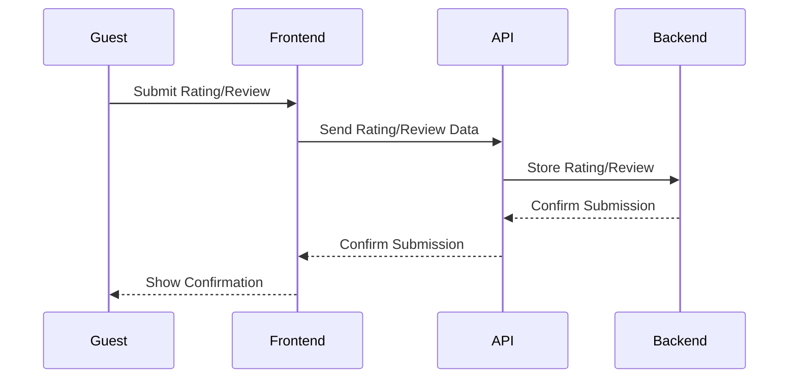

---

## 4. Package Diagram

```mermaid
classDiagram
package "Frontend" {
  class "UI Components"
  class "Map Module"
  class "Itinerary Planner"
  class "Shop Directory"
  class "Feedback Module"
  class "Analytics Dashboard"
}
package "Backend" {
  class "REST API"
  class "Admin Tools"
  class "ML Prediction Engine"
  class "Moderation Service"
}
package "Data" {
  class "Destination Data"
  class "Shop Data"
  class "Hotel Data"
  class "Feedback Data"
  class "User Data"
  class "Itinerary Data"
  class "Prediction Data"
  class "Waste Data"
}
"Frontend" ..> "Backend"
"Backend" ..> "Data"
"Backend" ..> "ML Prediction Engine"
"Backend" ..> "Moderation Service"
```

---

## 5. Deployment Diagram

```mermaid
graph TD
  UserDevice[User Device (Browser/Mobile)]
  WebServer[Web Server (Apache/Nginx)]
  AppServer[Application Server (PHP)]
  MLServer[ML Prediction Server (Python)]
  DB[Database (MySQL)]
  Storage[Image/File Storage]
  Notification[Notification Service]

  UserDevice --> WebServer
  WebServer --> AppServer
  AppServer --> DB
  AppServer --> Storage
  AppServer --> MLServer
  AppServer --> Notification
```

---

## 6. System Architecture (Conceptual Design)

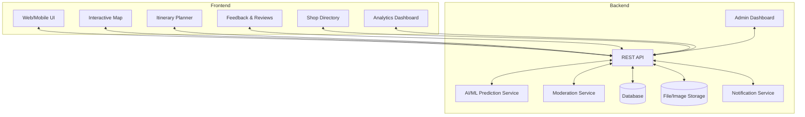

---
