# Legazpi Explorer — UML Diagrams

---

## 1. Use Case Diagram (Guest)

```mermaid
graph TB
    subgraph "Legazpi Explorer System"
        UC1["Browse Destinations"]
        UC2["View Interactive Map"]
        UC3["View Crowd Level Predictions"]
        UC4["Get Directions via GPS"]
        UC5["View Destination Alerts"]
        UC6["Browse Local Experiences"]
        UC7["Browse Festivals & Events"]
        UC8["Browse Novelty Shops"]
        UC9["View Shop Products"]
        UC10["Submit Shop/Product Rating"]
        UC11["Plan Itinerary"]
        UC12["Set Trip Preferences"]
        UC13["Select Destinations & Hotels"]
        UC14["Download Itinerary PDF"]
        UC15["Submit System Feedback"]
        UC16["View Weather Forecast"]
        UC18["View Visitor Forecasts"]
        UC19["View Waste Predictions"]
        UC20["Filter Destinations by Category"]
    end

    Guest(("👤 Guest"))

    Guest --> UC1
    Guest --> UC2
    Guest --> UC3
    Guest --> UC4
    Guest --> UC5
    Guest --> UC6
    Guest --> UC7
    Guest --> UC8
    Guest --> UC9
    Guest --> UC10
    Guest --> UC11
    Guest --> UC15
    Guest --> UC16

    UC11 --> UC12
    UC11 --> UC13
    UC11 --> UC14
    UC2 --> UC18
    UC2 --> UC19
    UC1 --> UC20
    UC2 --> UC4

    style Guest fill:#4CAF50,stroke:#333,color:#fff
    style UC1 fill:#e3f2fd,stroke:#1976D2
    style UC2 fill:#e3f2fd,stroke:#1976D2
    style UC3 fill:#e3f2fd,stroke:#1976D2
    style UC4 fill:#e3f2fd,stroke:#1976D2
    style UC5 fill:#e3f2fd,stroke:#1976D2
    style UC6 fill:#e3f2fd,stroke:#1976D2
    style UC7 fill:#e3f2fd,stroke:#1976D2
    style UC8 fill:#e3f2fd,stroke:#1976D2
    style UC9 fill:#e3f2fd,stroke:#1976D2
    style UC10 fill:#e3f2fd,stroke:#1976D2
    style UC11 fill:#e3f2fd,stroke:#1976D2
    style UC12 fill:#fff3e0,stroke:#FF9800
    style UC13 fill:#fff3e0,stroke:#FF9800
    style UC14 fill:#fff3e0,stroke:#FF9800
    style UC15 fill:#e3f2fd,stroke:#1976D2
    style UC16 fill:#e3f2fd,stroke:#1976D2
    style UC18 fill:#fff3e0,stroke:#FF9800
    style UC19 fill:#fff3e0,stroke:#FF9800
    style UC20 fill:#fff3e0,stroke:#FF9800
```

---

## 2. Use Case Diagram (Admin)

```mermaid
graph TB
    subgraph "Legazpi Explorer Admin Panel"
        UC1["Login / Logout"]
        UC2["View Dashboard Metrics"]
        UC3["Manage Destinations (CRUD)"]
        UC4["Manage Shops (CRUD)"]
        UC5["Manage Products (CRUD)"]
        UC6["Manage Product Categories"]
        UC7["Manage Hotels (CRUD)"]
        UC8["Manage Experiences (CRUD)"]
        UC9["Manage Festivals (CRUD)"]
        UC10["Manage Alerts (CRUD)"]
        UC11["View Feedback & Ratings"]
        UC12["Delete Reviews"]
        UC13["View Guest Activity Logs"]
        UC14["View Analytics Charts"]
        UC15["Upload Images / Videos"]
        UC16["View Rating Statistics"]
        UC17["Update Admin Profile"]
        UC18["View Guest Itineraries"]
        UC19["Set Destination Location via Map"]
    end

    Admin(("🔐 Admin"))

    Admin --> UC1
    Admin --> UC2
    Admin --> UC3
    Admin --> UC4
    Admin --> UC5
    Admin --> UC6
    Admin --> UC7
    Admin --> UC8
    Admin --> UC9
    Admin --> UC10
    Admin --> UC11
    Admin --> UC12
    Admin --> UC13
    Admin --> UC17

    UC2 --> UC14
    UC2 --> UC16
    UC2 --> UC18
    UC3 --> UC15
    UC3 --> UC19
    UC4 --> UC5
    UC4 --> UC6
    UC4 --> UC15
    UC7 --> UC15
    UC8 --> UC15
    UC9 --> UC15
    UC11 --> UC12
    UC2 --> UC13

    style Admin fill:#E91E63,stroke:#333,color:#fff
    style UC1 fill:#fce4ec,stroke:#C62828
    style UC2 fill:#fce4ec,stroke:#C62828
    style UC3 fill:#fce4ec,stroke:#C62828
    style UC4 fill:#fce4ec,stroke:#C62828
    style UC5 fill:#fff3e0,stroke:#FF9800
    style UC6 fill:#fff3e0,stroke:#FF9800
    style UC7 fill:#fce4ec,stroke:#C62828
    style UC8 fill:#fce4ec,stroke:#C62828
    style UC9 fill:#fce4ec,stroke:#C62828
    style UC10 fill:#fce4ec,stroke:#C62828
    style UC11 fill:#fce4ec,stroke:#C62828
    style UC12 fill:#fff3e0,stroke:#FF9800
    style UC13 fill:#fff3e0,stroke:#FF9800
    style UC14 fill:#fff3e0,stroke:#FF9800
    style UC15 fill:#fff3e0,stroke:#FF9800
    style UC16 fill:#fff3e0,stroke:#FF9800
    style UC17 fill:#fce4ec,stroke:#C62828
    style UC18 fill:#fff3e0,stroke:#FF9800
    style UC19 fill:#fff3e0,stroke:#FF9800
```

---

# GUEST SEQUENCE DIAGRAMS

---

## 3. Guest — Browse Destinations

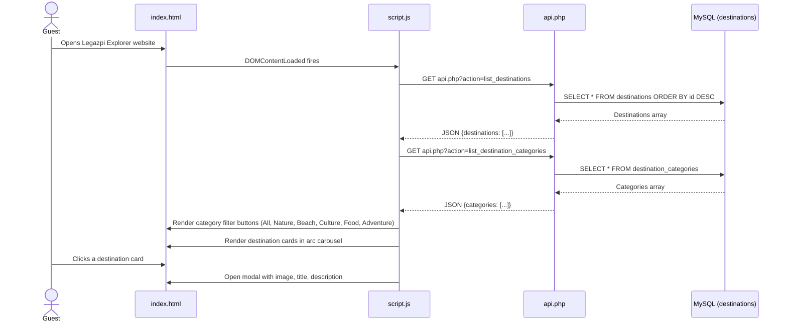

---

## 4. Guest — Filter Destinations by Category

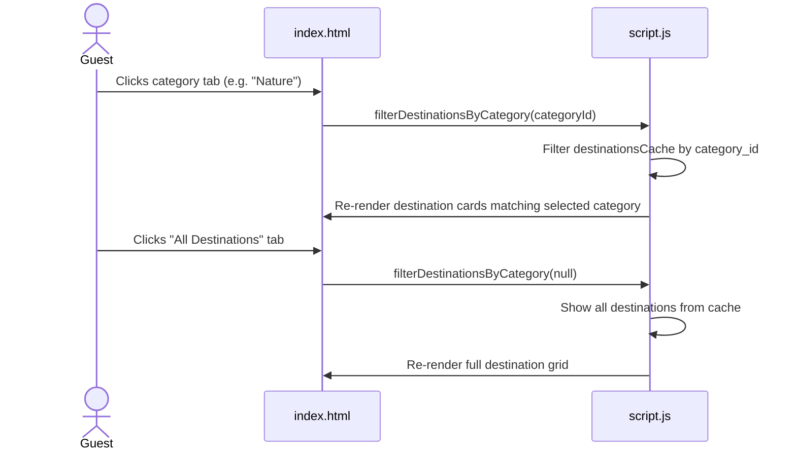

---

## 5. Guest — View Interactive Map with Crowd Levels

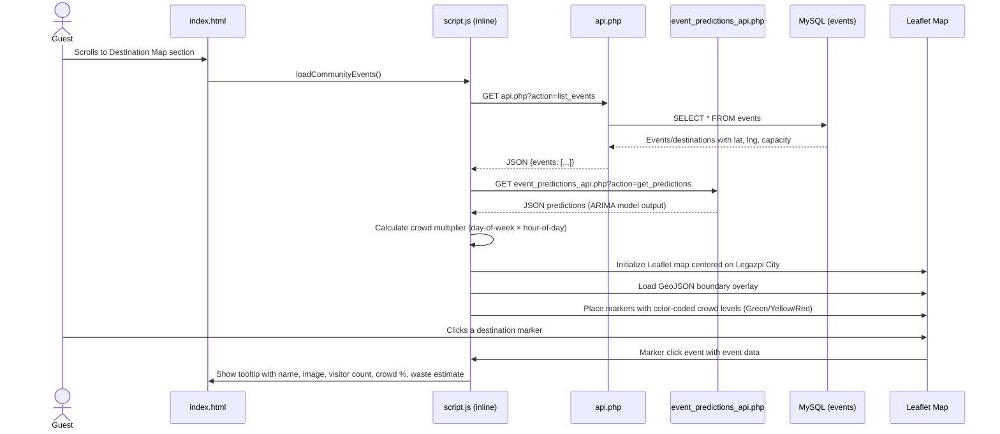

---

## 6. Guest — View Visitor Forecasts (Predictions)

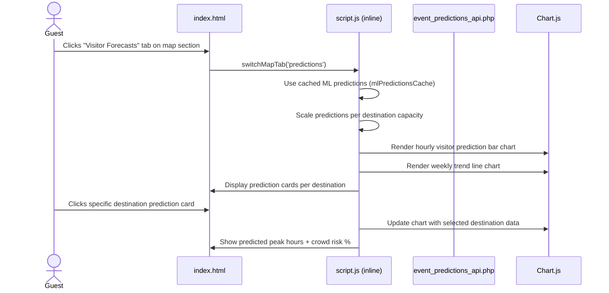

---

## 7. Guest — View Waste Predictions

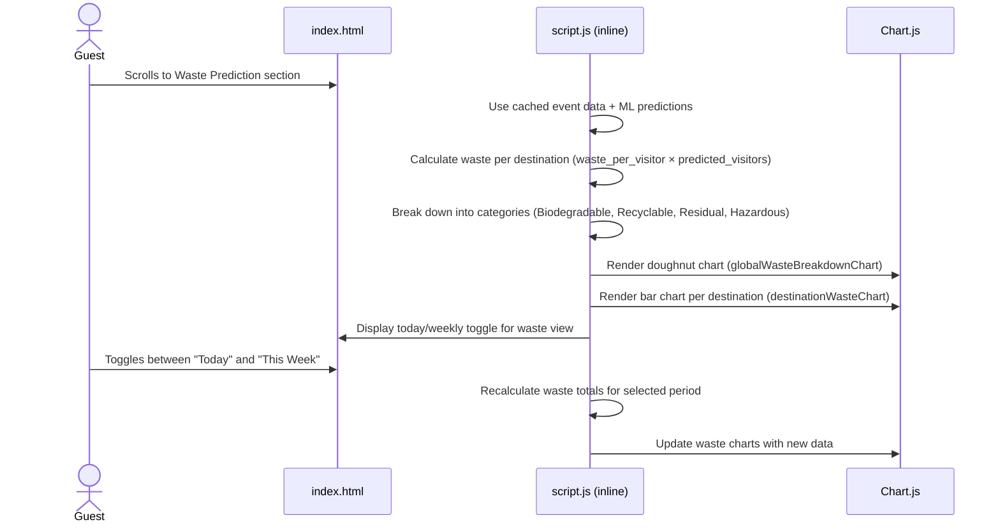

---

## 8. Guest — Get Directions via GPS

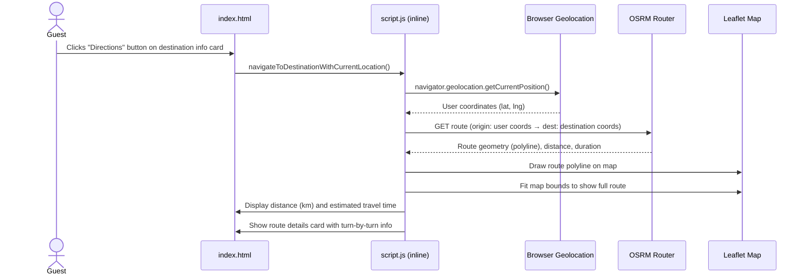

---

## 9. Guest — View Destination Alerts

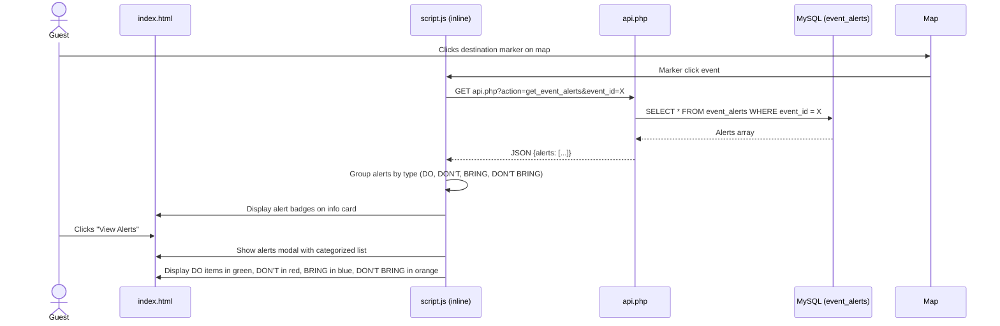

---

## 10. Guest — Browse Local Experiences

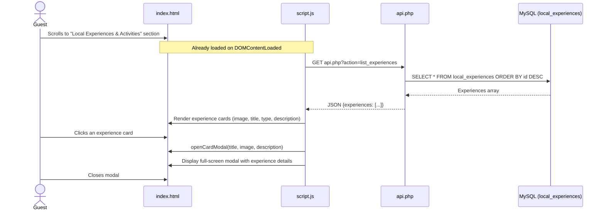

---

## 11. Guest — Browse Festivals & Events

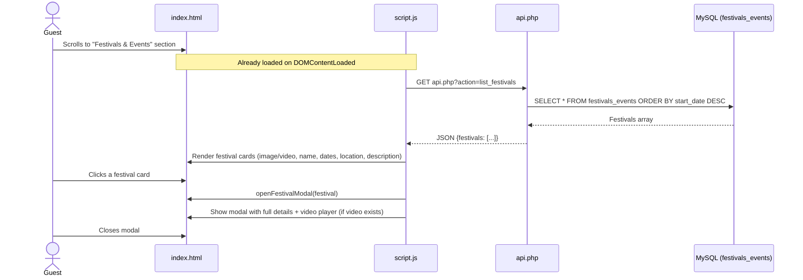

---

## 12. Guest — Browse Novelty Shops

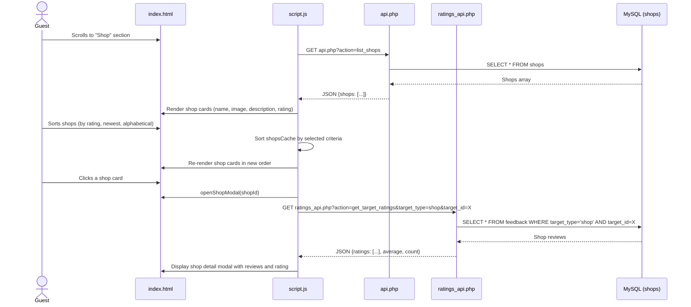

---

## 13. Guest — View Shop Products

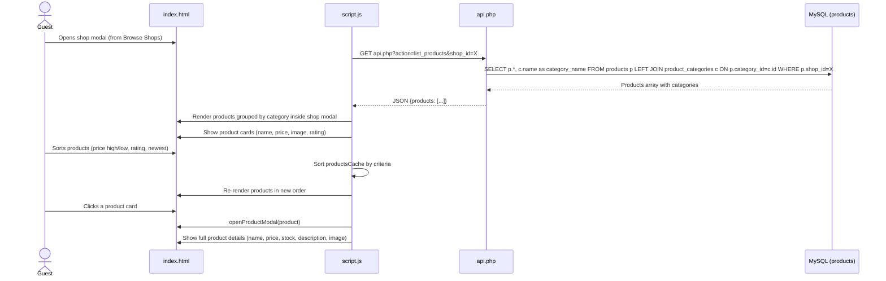

---

## 14. Guest — Submit Shop/Product Rating

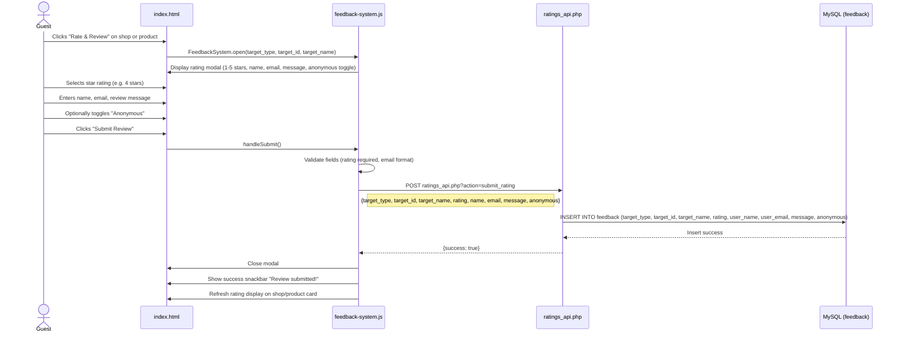

---

## 15. Guest — Plan Itinerary (Multi-Step)

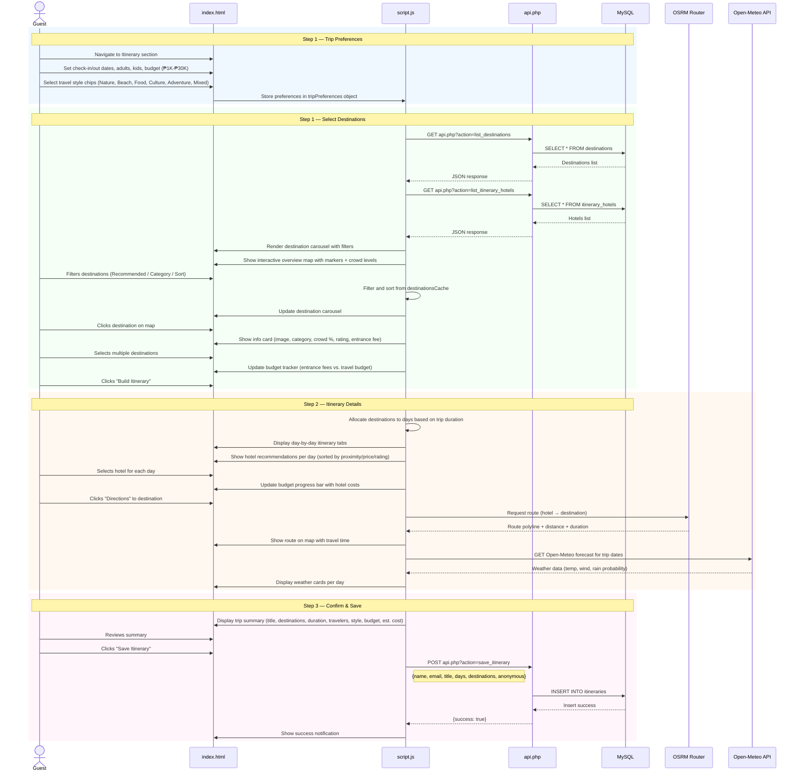

---

## 16. Guest — Download Itinerary PDF

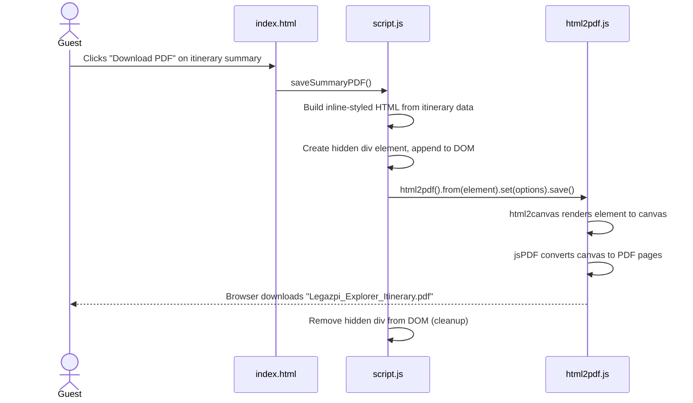

---

## 17. Guest — Submit System Feedback

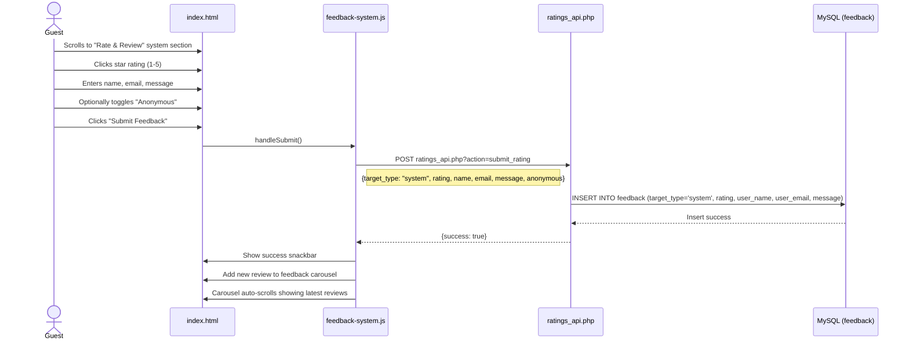

---

## 18. Guest — View Weather Forecast

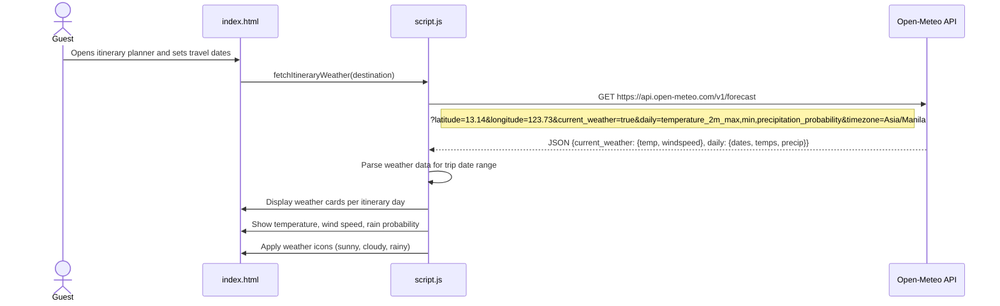

---

# ADMIN SEQUENCE DIAGRAMS

---

## 19. Admin — Login / Logout

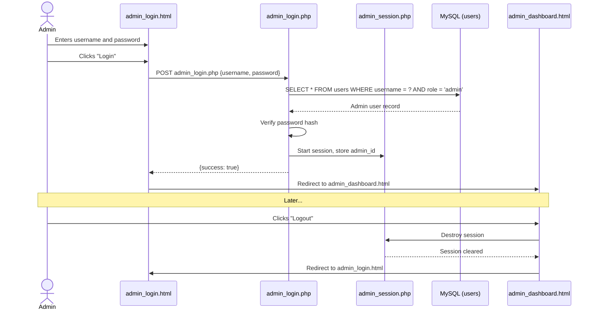

---

## 20. Admin — View Dashboard Metrics & Analytics

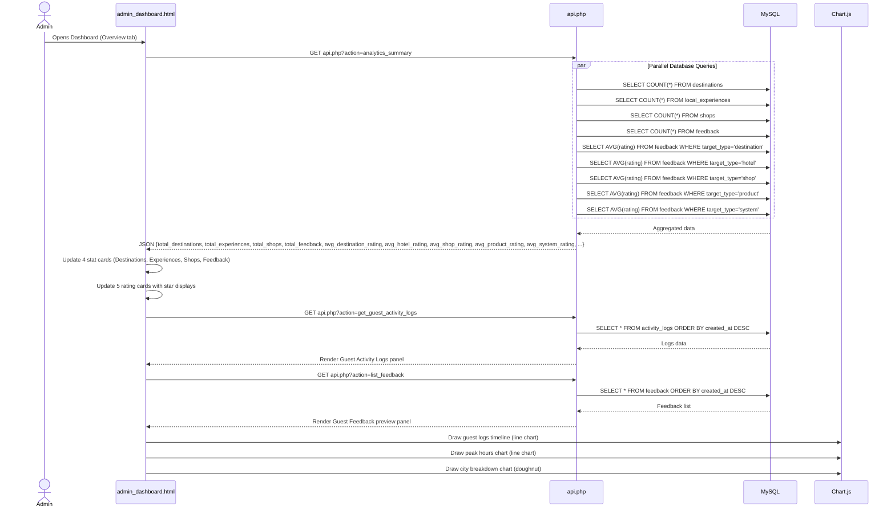

---

## 21. Admin — Manage Destinations (CRUD)

```mermaid
sequenceDiagram
    actor Admin
    participant UI as admin_dashboard.html
    participant API as api.php
    participant Upload as upload_destination_image.php
    participant DB as MySQL (destinations)
    participant Map as Leaflet Map

    Note over Admin,Map: CREATE
    Admin->>UI: Click "Destination Management" tab
    UI->>API: GET api.php?action=list_destinations
    API->>DB: SELECT * FROM destinations ORDER BY id DESC
    DB-->>API: Destinations list
    API-->>UI: Render destinations in grid

    Admin->>UI: Fill form: title, type, location, visitors, entrance fee, description
    Admin->>UI: Set open days (start → end), operating hours (start/end time)
    Admin->>Map: Click map to pin location (lat, lng auto-filled)
    Admin->>UI: Select image file
    UI->>Upload: POST FormData (image)
    Upload-->>UI: {success: true, path: "uploads/destination_xxx.jpg"}
    Admin->>UI: Click "Add Destination"
    UI->>API: POST api.php?action=create_event
    Note right of UI: {title, type, location, lat, lng, expected_visitors, entrance_fee, description, image, open_days_start, open_days_end, hours_start, hours_end, ...}
    API->>DB: INSERT INTO destinations (...)
    DB-->>API: Insert success
    API-->>UI: {success: true}
    UI->>UI: Refresh destinations list

    Note over Admin,Map: EDIT
    Admin->>UI: Click "Edit" on destination card
    UI->>UI: Populate form with existing data (title, type, location, hours, etc.)
    UI->>Map: Show existing pin on map
    Admin->>UI: Modify fields
    Admin->>UI: Click "Update Destination"
    UI->>API: POST api.php?action=edit_event {id, ...updated fields}
    API->>DB: UPDATE destinations SET ... WHERE id = X
    DB-->>API: Update success
    API-->>UI: {success: true}
    UI->>UI: Refresh list

    Note over Admin,Map: DELETE
    Admin->>UI: Click "Delete" on destination card
    UI->>UI: Confirm deletion dialog
    Admin->>UI: Confirms
    UI->>API: POST api.php?action=delete_event {id}
    API->>DB: DELETE FROM destinations WHERE id = X
    DB-->>API: Delete success
    API-->>UI: {success: true}
    UI->>UI: Remove card from list
```

---

## 22. Admin — Manage Shops (CRUD)

```mermaid
sequenceDiagram
    actor Admin
    participant UI as admin_dashboard.html
    participant API as api.php
    participant Upload as upload_shop_image.php
    participant DB as MySQL (shops)
    participant Map as Leaflet Map

    Note over Admin,Map: LIST
    Admin->>UI: Click "Shops" tab
    UI->>API: GET api.php?action=list_shops
    API->>DB: SELECT * FROM shops ORDER BY id DESC
    DB-->>API: Shops array
    API-->>UI: Render shop cards with ratings overview

    Note over Admin,Map: CREATE
    Admin->>UI: Fill shop form: name, owner, address, contact, description
    Admin->>Map: Pin shop location on map (lat, lng)
    Admin->>UI: Select image file
    UI->>Upload: POST FormData (image)
    Upload-->>UI: {success: true, path: "uploads/shop_xxx.jpg"}
    Admin->>UI: Click "Add Shop"
    UI->>API: POST api.php?action=create_shop
    Note right of UI: {name, owner, address, contact, description, image, lat, lng}
    API->>DB: INSERT INTO shops (...)
    DB-->>API: Insert success
    API-->>UI: {success: true}
    UI->>UI: Refresh shops list

    Note over Admin,Map: EDIT
    Admin->>UI: Click "Edit" on shop
    UI->>UI: Populate form with shop data
    Admin->>UI: Modify fields, click "Update"
    UI->>API: POST api.php?action=edit_shop {id, ...}
    API->>DB: UPDATE shops SET ... WHERE id = X
    DB-->>API: Update success
    API-->>UI: {success: true}

    Note over Admin,Map: DELETE
    Admin->>UI: Click "Delete" on shop
    UI->>API: POST api.php?action=delete_shop {id}
    API->>DB: DELETE FROM shops WHERE id = X
    DB-->>API: Delete success
    API-->>UI: Remove shop from list
```

---

## 23. Admin — Manage Products (CRUD)

```mermaid
sequenceDiagram
    actor Admin
    participant UI as admin_dashboard.html
    participant API as api.php
    participant Upload as upload_product_image.php
    participant DB as MySQL (products)

    Note over Admin,DB: LIST
    Admin->>UI: Click "View Products" on a shop
    UI->>API: GET api.php?action=list_products&shop_id=X
    API->>DB: SELECT p.*, c.name as category_name FROM products p LEFT JOIN product_categories c ON p.category_id=c.id WHERE p.shop_id=X
    DB-->>API: Products array
    API-->>UI: Render product cards per shop

    Note over Admin,DB: CREATE
    Admin->>UI: Fill product form: name, category, price, stock, description
    Admin->>UI: Select product image
    UI->>Upload: POST FormData (image)
    Upload-->>UI: {success: true, path: "uploads/product_xxx.jpg"}
    Admin->>UI: Click "Add Product"
    UI->>API: POST api.php?action=create_product
    Note right of UI: {shop_id, name, category_id, price, stock, description, image}
    API->>DB: INSERT INTO products (...)
    DB-->>API: Insert success
    API-->>UI: {success: true}
    UI->>UI: Refresh product list

    Note over Admin,DB: EDIT
    Admin->>UI: Click "Edit" on product
    UI->>UI: Populate form
    Admin->>UI: Modify fields, click "Update"
    UI->>API: POST api.php?action=edit_product {id, ...}
    API->>DB: UPDATE products SET ... WHERE id = X
    DB-->>API: Update success
    API-->>UI: {success: true}

    Note over Admin,DB: DELETE
    Admin->>UI: Click "Delete" on product
    UI->>API: POST api.php?action=delete_product {id}
    API->>DB: DELETE FROM products WHERE id = X
    DB-->>API: Delete success
    API-->>UI: Remove from list
```

---

## 24. Admin — Manage Product Categories

```mermaid
sequenceDiagram
    actor Admin
    participant UI as admin_dashboard.html
    participant API as api.php
    participant DB as MySQL (product_categories)

    Admin->>UI: Click "Manage Categories" on a shop
    UI->>API: GET api.php?action=list_categories&shop_id=X
    API->>DB: SELECT * FROM product_categories WHERE shop_id = X
    DB-->>API: Categories array
    API-->>UI: Render categories list

    Admin->>UI: Enter new category name
    Admin->>UI: Click "Add Category"
    UI->>API: POST api.php?action=create_category {shop_id, name}
    API->>DB: INSERT INTO product_categories (shop_id, name)
    DB-->>API: Insert success
    API-->>UI: {success: true}
    UI->>UI: Refresh categories

    Admin->>UI: Click "Edit" on category
    Admin->>UI: Modify name, click "Save"
    UI->>API: POST api.php?action=edit_category {id, name}
    API->>DB: UPDATE product_categories SET name = ? WHERE id = X
    DB-->>API: Update success
    API-->>UI: {success: true}

    Admin->>UI: Click "Delete" category
    UI->>API: POST api.php?action=delete_category {id}
    API->>DB: DELETE FROM product_categories WHERE id = X
    DB-->>API: Delete success
    API-->>UI: Remove from list
```

---

## 25. Admin — Manage Hotels (CRUD)

```mermaid
sequenceDiagram
    actor Admin
    participant UI as admin_dashboard.html
    participant API as api.php
    participant Upload as upload_hotel_image.php
    participant DB as MySQL (itinerary_hotels)
    participant Map as Leaflet Map

    Note over Admin,Map: LIST
    Admin->>UI: Click "Hotels" tab
    UI->>API: GET api.php?action=list_itinerary_hotels
    API->>DB: SELECT * FROM itinerary_hotels ORDER BY id DESC
    DB-->>API: Hotels array
    API-->>UI: Render hotel cards

    Note over Admin,Map: CREATE
    Admin->>UI: Fill hotel form: name, category (Budget/Standard/Boutique/Luxury/Resort), rate/night, phone, address, description, features
    Admin->>Map: Pin hotel location (lat, lng)
    Admin->>UI: Select image
    UI->>Upload: POST FormData (image)
    Upload-->>UI: {success: true, path: "uploads/hotel_xxx.jpg"}
    Admin->>UI: Click "Add Hotel"
    UI->>API: POST api.php?action=add_itinerary_hotel
    Note right of UI: {name, category, rate, phone, address, description, features, image, lat, lng}
    API->>DB: INSERT INTO itinerary_hotels (...)
    DB-->>API: Insert success
    API-->>UI: {success: true}
    UI->>UI: Refresh hotels list

    Note over Admin,Map: EDIT
    Admin->>UI: Click "Edit" on hotel
    UI->>UI: Populate form with hotel data
    Admin->>UI: Modify fields, click "Update"
    UI->>API: POST api.php?action=edit_itinerary_hotel {id, ...}
    API->>DB: UPDATE itinerary_hotels SET ... WHERE id = X
    DB-->>API: Update success
    API-->>UI: {success: true}

    Note over Admin,Map: DELETE
    Admin->>UI: Click "Delete" on hotel
    UI->>API: POST api.php?action=delete_itinerary_hotel {id}
    API->>DB: DELETE FROM itinerary_hotels WHERE id = X
    DB-->>API: Delete success
    API-->>UI: Remove from list
```

---

## 26. Admin — Manage Experiences (CRUD)

```mermaid
sequenceDiagram
    actor Admin
    participant UI as admin_dashboard.html
    participant API as api.php
    participant Upload as upload_experience_image.php
    participant DB as MySQL (local_experiences)

    Note over Admin,DB: LIST
    Admin->>UI: Click "Experiences" tab
    UI->>API: GET api.php?action=list_experiences
    API->>DB: SELECT * FROM local_experiences ORDER BY id DESC
    DB-->>API: Experiences array
    API-->>UI: Render experience cards (title, type, price, duration)

    Note over Admin,DB: CREATE
    Admin->>UI: Fill form: title, type/category, price, duration, description
    Admin->>UI: Select image
    UI->>Upload: POST FormData (image)
    Upload-->>UI: {success: true, path: "uploads/experience_xxx.jpg"}
    Admin->>UI: Click "Add Experience"
    UI->>API: POST api.php?action=create_experience
    Note right of UI: {title, type, price, duration, description, image}
    API->>DB: INSERT INTO local_experiences (title, type, price, duration, description, image)
    DB-->>API: Insert success
    API-->>UI: {success: true}
    UI->>UI: Refresh experiences list

    Note over Admin,DB: EDIT
    Admin->>UI: Click "Edit" on experience
    UI->>UI: Populate form (title, type, price, duration, description, image)
    Admin->>UI: Modify fields, click "Update"
    UI->>API: POST api.php?action=edit_experience {id, title, type, price, duration, description, image}
    API->>DB: UPDATE local_experiences SET ... WHERE id = X
    DB-->>API: Update success
    API-->>UI: {success: true}

    Note over Admin,DB: DELETE
    Admin->>UI: Click "Delete" on experience
    UI->>API: POST api.php?action=delete_experience {id}
    API->>DB: DELETE FROM local_experiences WHERE id = X
    DB-->>API: Delete success
    API-->>UI: Remove from list
```

---

## 27. Admin — Manage Festivals (CRUD)

```mermaid
sequenceDiagram
    actor Admin
    participant UI as admin_dashboard.html
    participant API as api.php
    participant Upload as upload_festival_image.php
    participant DB as MySQL (festivals_events)

    Note over Admin,DB: LIST
    Admin->>UI: Click "Festivals" tab
    UI->>API: GET api.php?action=list_festivals
    API->>DB: SELECT * FROM festivals_events ORDER BY start_date DESC
    DB-->>API: Festivals array
    API-->>UI: Render festival cards (name, dates, location, type)

    Note over Admin,DB: CREATE
    Admin->>UI: Fill form: name, location, start date, end date, type, expected attendance, description
    Admin->>UI: Select image or video file
    UI->>Upload: POST FormData (image/video)
    Upload-->>UI: {success: true, path: "uploads/festival_xxx.jpg"}
    Admin->>UI: Click "Add Festival"
    UI->>API: POST api.php?action=create_festival
    Note right of UI: {name, location, start_date, end_date, type, expected_attendance, description, image}
    API->>DB: INSERT INTO festivals_events (...)
    DB-->>API: Insert success
    API-->>UI: {success: true}
    UI->>UI: Refresh festivals list

    Note over Admin,DB: EDIT
    Admin->>UI: Click "Edit" on festival
    UI->>UI: Populate form
    Admin->>UI: Modify fields, click "Update"
    UI->>API: POST api.php?action=edit_festival {id, ...}
    API->>DB: UPDATE festivals_events SET ... WHERE id = X
    DB-->>API: Update success
    API-->>UI: {success: true}

    Note over Admin,DB: DELETE
    Admin->>UI: Click "Delete" on festival
    UI->>API: POST api.php?action=delete_festival {id}
    API->>DB: DELETE FROM festivals_events WHERE id = X
    DB-->>API: Delete success
    API-->>UI: Remove from list
```

---

## 28. Admin — Manage Alerts (CRUD)

```mermaid
sequenceDiagram
    actor Admin
    participant UI as admin_dashboard.html
    participant API as api.php
    participant DB as MySQL (event_alerts)

    Note over Admin,DB: LIST
    Admin->>UI: Click "Alerts" tab
    UI->>API: GET api.php?action=get_event_alerts
    API->>DB: SELECT a.*, e.title as event_name FROM event_alerts a LEFT JOIN events e ON a.event_id=e.id
    DB-->>API: Alerts array with event names
    API-->>UI: Render active alerts list

    Note over Admin,DB: CREATE
    Admin->>UI: Select destination from dropdown
    Admin->>UI: Select alert type (DO / DON'T / BRING / DON'T BRING)
    Admin->>UI: Optionally toggle "Global alert"
    Admin->>UI: Enter alert message
    Admin->>UI: Click "Add Alert"
    UI->>API: POST api.php?action=add_event_alert
    Note right of UI: {event_id, alert_type, content, is_global}
    API->>DB: INSERT INTO event_alerts (event_id, alert_type, content, is_global)
    DB-->>API: Insert success
    API-->>UI: {success: true}
    UI->>UI: Refresh alerts list

    Note over Admin,DB: EDIT
    Admin->>UI: Click "Edit" on alert
    UI->>UI: Populate form with alert data
    Admin->>UI: Modify fields, click "Update"
    UI->>API: POST api.php?action=edit_alert {id, event_id, alert_type, content, is_global}
    API->>DB: UPDATE event_alerts SET ... WHERE id = X
    DB-->>API: Update success
    API-->>UI: {success: true}

    Note over Admin,DB: DELETE
    Admin->>UI: Click "Delete" on alert
    UI->>API: POST api.php?action=delete_alert {id}
    API->>DB: DELETE FROM event_alerts WHERE id = X
    DB-->>API: Delete success
    API-->>UI: Remove from list
```

---

## 29. Admin — View & Manage Feedback/Ratings

```mermaid
sequenceDiagram
    actor Admin
    participant UI as admin_dashboard.html
    participant API as api.php
    participant RAPI as ratings_api.php
    participant DB as MySQL (feedback)

    Admin->>UI: Click "Feedback & Ratings" tab
    UI->>API: GET api.php?action=list_feedback
    API->>DB: SELECT * FROM feedback ORDER BY created_at DESC
    DB-->>API: All feedback/reviews
    API-->>UI: JSON {feedback: [...]}

    UI->>UI: Calculate rating statistics (total reviews, averages per type, positive %)
    UI->>UI: Render statistics cards
    UI->>UI: Render feedback list (user, rating stars, message, type, date)

    Admin->>UI: Filter by type (shop / product / destination / hotel / system)
    UI->>UI: Filter displayed feedback by selected target_type
    Admin->>UI: Filter by rating (1-5 stars)
    UI->>UI: Filter displayed feedback by selected rating

    Admin->>UI: Click "Delete" on a review
    UI->>RAPI: DELETE ratings_api.php?action=delete_rating {id}
    RAPI->>DB: DELETE FROM feedback WHERE id = X
    DB-->>RAPI: Delete success
    RAPI-->>UI: {success: true}
    UI->>UI: Remove review from list
    UI->>UI: Recalculate statistics
```

---

## 30. Admin — View Guest Activity Logs

```mermaid
sequenceDiagram
    actor Admin
    participant UI as admin_dashboard.html
    participant API as api.php
    participant DB as MySQL (activity_logs)

    Admin->>UI: Opens Dashboard → Guest Logs panel
    UI->>API: GET api.php?action=get_guest_activity_logs
    API->>DB: SELECT * FROM activity_logs ORDER BY created_at DESC LIMIT 100
    DB-->>API: Activity logs array
    API-->>UI: JSON {logs: [...]}
    UI->>UI: Render logs list (user, action, page, timestamp)

    Admin->>UI: Clicks "Refresh" button
    UI->>API: GET api.php?action=get_guest_activity_logs
    API->>DB: SELECT * FROM activity_logs ORDER BY created_at DESC
    DB-->>API: Latest logs
    API-->>UI: Update logs panel with fresh data
    UI->>UI: Update log count badge
```

---

## 31. Admin — Update Profile Image

```mermaid
sequenceDiagram
    actor Admin
    participant UI as admin_dashboard.html
    participant Upload as upload_admin_profile.php
    participant Storage as localStorage

    Admin->>UI: Clicks admin profile image in header
    UI->>UI: Open file picker dialog
    Admin->>UI: Selects new profile image file
    UI->>Upload: POST FormData (image file)
    Upload->>Upload: Validate file type and size
    Upload->>Upload: Save to backend/uploads/ directory
    Upload-->>UI: {success: true, path: "uploads/admin_profile_xxx.jpg"}
    UI->>Storage: Store image path in localStorage ('adminProfileImage')
    UI->>UI: Update profile image in header with new image
```

---

# PACKAGE DIAGRAM

---

## 32. Package Diagram

```mermaid
graph TB
    subgraph "🖥️ Presentation Layer"
        direction TB
        P1["index.html<br/><i>Guest Interface</i>"]
        P2["admin_dashboard.html<br/><i>Admin Interface</i>"]
        P3["style.css<br/><i>Styles & Animations</i>"]
    end

    subgraph "📦 Frontend Logic Layer"
        direction TB
        F1["script.js<br/><i>Core Application Logic</i><br/>Destinations, Shops, Hotels,<br/>Itinerary, Weather, Tracking"]
        F2["feedback-system.js<br/><i>Rating & Review Module</i>"]
        F3["shop-ratings.js<br/><i>Shop Rating Manager</i>"]
        F4["contextual-feedback.js<br/><i>Contextual Feedback</i>"]
        F5["shop-feedback-sync.js<br/><i>Feedback Sync</i>"]
        F6["nlp-analytics.js<br/><i>NLP Analytics UI</i>"]
    end

    subgraph "📚 External Libraries"
        direction TB
        L1["Leaflet.js<br/><i>Interactive Maps</i>"]
        L2["Chart.js<br/><i>Analytics Charts</i>"]
        L3["html2pdf.js<br/><i>PDF Generation</i>"]
        L4["OSRM<br/><i>Road Routing</i>"]
        L5["Open-Meteo API<br/><i>Weather Data</i>"]
    end

    subgraph "⚙️ Backend API Layer"
        direction TB
        B1["api.php<br/><i>Main REST API Router</i><br/>80+ Action Handlers"]
        B2["ratings_api.php<br/><i>Ratings & Reviews API</i>"]
        B3["admin_login.php<br/><i>Authentication</i>"]
        B4["admin_session.php<br/><i>Session Management</i>"]
    end

    subgraph "📤 Upload Handlers"
        direction TB
        U1["upload_destination_image.php"]
        U2["upload_shop_image.php"]
        U3["upload_product_image.php"]
        U4["upload_hotel_image.php"]
        U5["upload_experience_image.php"]
        U6["upload_festival_image.php"]
    end

    subgraph "🤖 ML / AI Layer"
        direction TB
        M1["ml_predict.php<br/><i>ML Prediction Runner</i>"]
        M2["MLServerBridge.php<br/><i>ML Server Bridge</i>"]
        M3["ml_api_client.php<br/><i>ML API Client</i>"]
        M4["event_predictions_api.php<br/><i>ARIMA Predictions</i>"]
        M5["nlp_analyzer.py<br/><i>NLP Sentiment Analysis</i>"]
        M6["ml/ server.js<br/><i>Node.js ML Server</i>"]
    end

    subgraph "🗄️ Data Layer"
        direction TB
        D1["db.php<br/><i>MySQL Connection</i>"]
        D2[("MySQL Database<br/><i>capstone_db</i><br/>23 Tables")]
    end

    subgraph "📁 Database Tables"
        direction TB
        T1["destinations / events"]
        T2["shops / products / product_categories"]
        T3["itinerary_hotels / itinerary_destinations"]
        T4["local_experiences / festivals_events"]
        T5["feedback (ratings & reviews)"]
        T6["itineraries / users"]
        T7["event_alerts / event_predictions"]
        T8["activity_logs / anonymous_sessions"]
        T9["place_analytics / shop_interactions"]
    end

    P1 --> F1
    P1 --> F2
    P1 --> F3
    P1 --> F4
    P1 --> F5
    P2 --> F1

    F1 --> L1
    F1 --> L2
    F1 --> L3
    F1 --> L4
    F1 --> L5

    F1 --> B1
    F2 --> B2
    F3 --> B2
    P2 --> B1
    P2 --> B2
    P2 --> B3

    B1 --> D1
    B2 --> D1
    B3 --> D1
    B4 --> D1
    B1 --> M1
    B1 --> M4

    M1 --> M2
    M2 --> M6
    M1 --> M3

    D1 --> D2
    D2 --> T1
    D2 --> T2
    D2 --> T3
    D2 --> T4
    D2 --> T5
    D2 --> T6
    D2 --> T7
    D2 --> T8
    D2 --> T9

    B1 --> U1
    B1 --> U2
    B1 --> U3
    B1 --> U4
    B1 --> U5
    B1 --> U6

    style P1 fill:#e3f2fd,stroke:#1565C0,color:#000
    style P2 fill:#fce4ec,stroke:#C62828,color:#000
    style P3 fill:#e8eaf6,stroke:#283593,color:#000
    style F1 fill:#fff3e0,stroke:#E65100,color:#000
    style F2 fill:#fff3e0,stroke:#E65100,color:#000
    style F3 fill:#fff3e0,stroke:#E65100,color:#000
    style B1 fill:#e8f5e9,stroke:#2E7D32,color:#000
    style B2 fill:#e8f5e9,stroke:#2E7D32,color:#000
    style D1 fill:#f3e5f5,stroke:#6A1B9A,color:#000
    style D2 fill:#f3e5f5,stroke:#6A1B9A,color:#000
    style M1 fill:#fff8e1,stroke:#F57F17,color:#000
    style M6 fill:#fff8e1,stroke:#F57F17,color:#000
```

---

## Diagram Summary

| # | Diagram | Actor | Description |
|---|---------|-------|-------------|
| 1 | Use Case (Guest) | Guest | 19 use cases: browsing, map, directions, itinerary, ratings, weather |
| 2 | Use Case (Admin) | Admin | 19 use cases: CRUD for 6 entities, analytics, feedback, alerts |
| 3 | Browse Destinations | Guest | Load destinations from DB, render carousel with category filters |
| 4 | Filter Destinations | Guest | Client-side category filtering from cached data |
| 5 | Interactive Map | Guest | Leaflet map with crowd-level markers + ML predictions |
| 6 | Visitor Forecasts | Guest | ARIMA model predictions rendered in Chart.js |
| 7 | Waste Predictions | Guest | Waste breakdown doughnut + per-destination bar charts |
| 8 | Get Directions | Guest | GPS geolocation → OSRM routing → polyline on map |
| 9 | Destination Alerts | Guest | Fetch DO/DON'T/BRING alerts per destination |
| 10 | Browse Experiences | Guest | Load experiences grid from local_experiences table |
| 11 | Browse Festivals | Guest | Load festivals with image/video from festivals_events table |
| 12 | Browse Shops | Guest | Load shops with sorting, open detail modal with reviews |
| 13 | View Products | Guest | Load products by shop, grouped by category |
| 14 | Submit Rating | Guest | Universal feedback modal → ratings_api.php → feedback table |
| 15 | Plan Itinerary | Guest | 3-step: preferences → select destinations/hotels → confirm & save |
| 16 | Download PDF | Guest | html2pdf.js generates PDF from itinerary summary |
| 17 | System Feedback | Guest | Rate the system (1-5 stars) → feedback carousel |
| 18 | Weather Forecast | Guest | Open-Meteo API → weather cards per itinerary day |
| 19 | Admin Login/Logout | Admin | Session-based authentication |
| 20 | Dashboard Metrics | Admin | Analytics summary with parallel DB queries + Chart.js |
| 21 | Manage Destinations | Admin | Full CRUD with map pin + image upload |
| 22 | Manage Shops | Admin | Full CRUD with map location + image upload |
| 23 | Manage Products | Admin | Full CRUD per shop with image upload |
| 24 | Manage Categories | Admin | CRUD product categories per shop |
| 25 | Manage Hotels | Admin | Full CRUD with map pin + image upload |
| 26 | Manage Experiences | Admin | Full CRUD with price, duration, image upload |
| 27 | Manage Festivals | Admin | Full CRUD with dates, attendance, image/video upload |
| 28 | Manage Alerts | Admin | CRUD destination alerts (DO/DON'T/BRING/DON'T BRING) |
| 29 | Manage Feedback | Admin | View, filter, delete ratings/reviews |
| 30 | Guest Activity Logs | Admin | View tracked guest interactions |
| 31 | Update Profile | Admin | Upload profile image (localStorage + backend) |
| 32 | Package Diagram | System | 7-layer architecture with all components |
