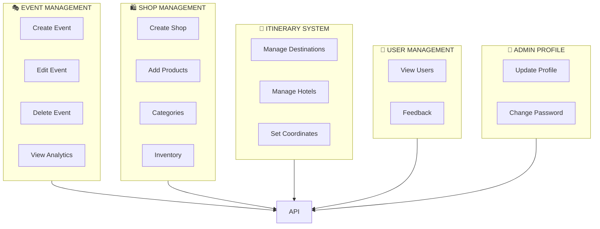
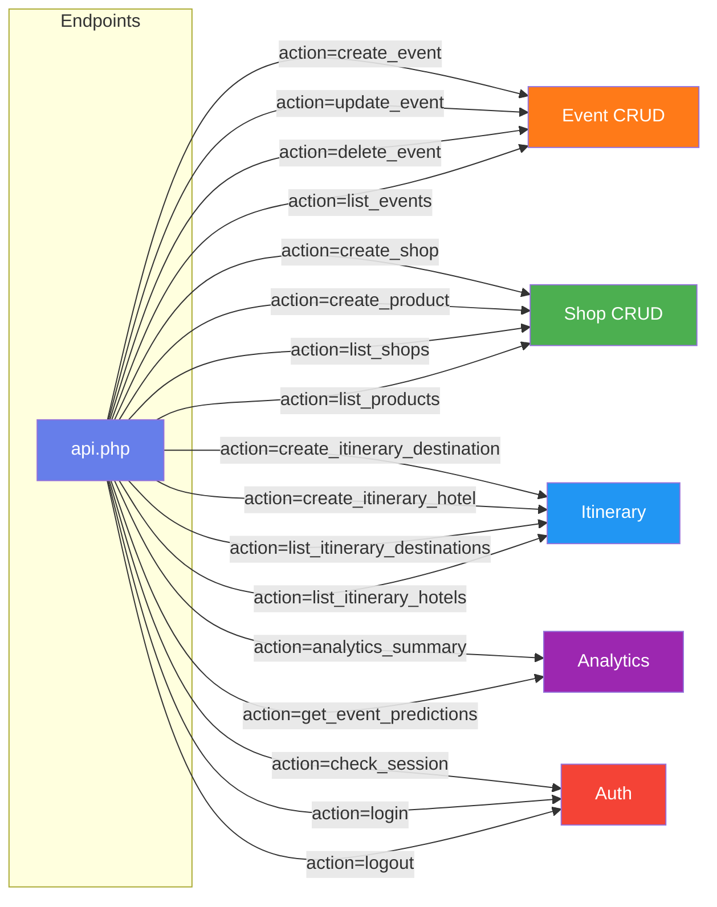
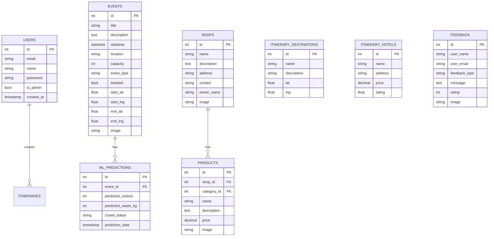
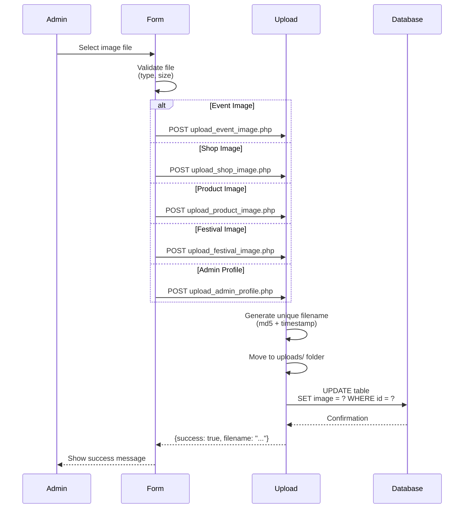
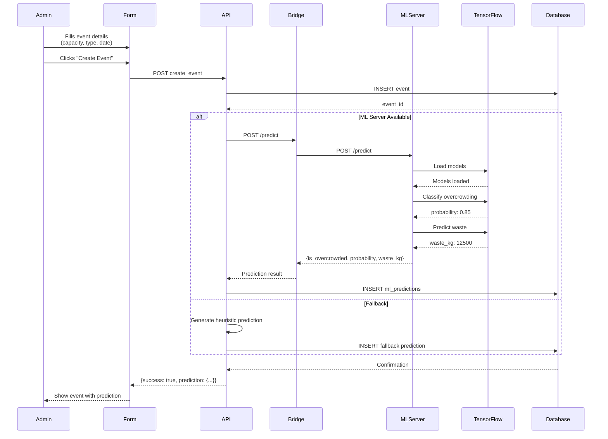
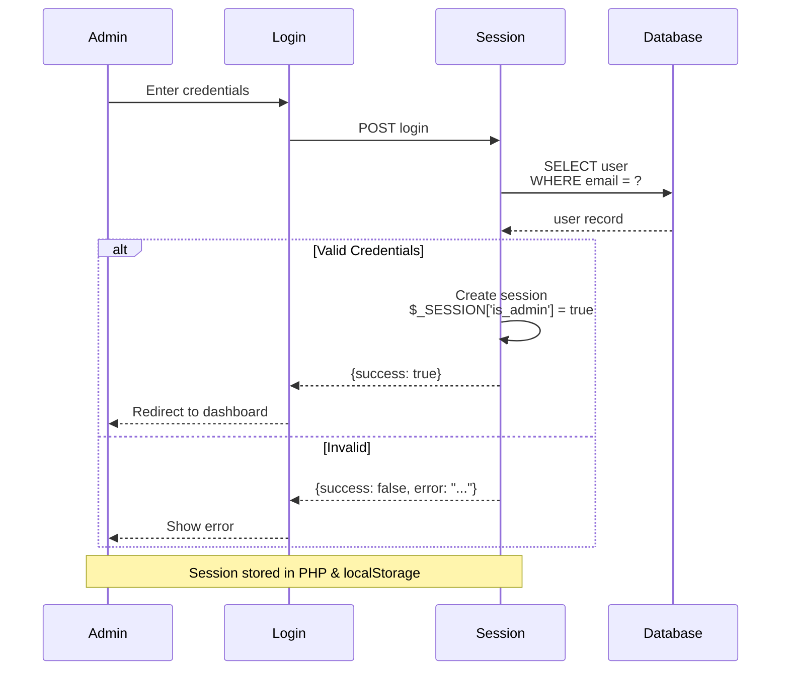

# Admin Package Diagram - Legazpi Explorer

This document shows the package/component structure and dependencies for the **Admin Side** of the Legazpi Explorer system.

---

## Admin Package Overview

```mermaid
graph TD
    subgraph AdminUI["🖥️ ADMIN DASHBOARD (admin_dashboard.html)"]
        UI[Dashboard UI]
        Forms[Event/Shop/Itinerary Forms]
        Charts[Analytics Charts]
        Maps[Route Picker Maps]
    end
    
    subgraph Auth["🔐 AUTHENTICATION"]
        Login[admin_login.html]
        Session[admin_session.php]
    end
    
    subgraph API["📡 PHP BACKEND"]
        API[api.php]
        Events[Event Management]
        Shops[Shop Management]
        Itin[Itinerary Management]
        ML[ML Predictions]
    end
    
    subgraph Upload["📤 UPLOAD HANDLERS"]
        EventImg[upload_event_image.php]
        ShopImg[upload_shop_image.php]
        ProdImg[upload_product_image.php]
        FestImg[upload_festival_image.php]
        AdminImg[upload_admin_profile.php]
    end
    
    subgraph ML["🤖 ML INTEGRATION"]
        Bridge[MLServerBridge.php]
        Server[ML Server :3000]
        TensorFlow[TensorFlow.js]
    end
    
    subgraph Database["🗄️ DATABASE"]
        DB[(MySQL Database)]
        Tables[Tables: events, shops, products, itineraries, etc.]
    end
    
    UI --> API
    Forms --> API
    API --> DB
    API --> Bridge
    Bridge --> Server
    Server --> TensorFlow
    Upload --> DB
    Login --> Session
    Session --> API
```

---

## Admin Features Package



---

## API Endpoints (Admin)



---

## Database Tables (Admin)



---

## Upload Flow



---

## ML Prediction Flow (Admin)



---

## Admin Session Flow



---

## File Structure

```
backend/
├── api.php                          # Main API (admin + guest)
├── admin_login.php                   # Login page
├── admin_session.php                # Session management
├── db.php                          # Database connection
│
├── upload_event_image.php           # Event image upload
├── upload_shop_image.php            # Shop image upload
├── upload_product_image.php         # Product image upload
├── upload_festival_image.php      # Festival image upload
├── upload_admin_profile.php        # Admin profile upload
├── upload_destination_image.php  # Destination image upload
├── upload_experience_image.php    # Experience image upload
├── upload_feedback_image.php      # Feedback image upload
├── upload_itinerary_image.php     # Itinerary image upload
│
├── MLServerBridge.php              # ML Server bridge
├── ml_api_client.php             # ML API client
├── event_predictions_api.php      # Event predictions
├── predictions_api.php           # Legacy predictions
│
├── submit_feedback.php             # Feedback submission
├── verify_google.php            # Google verification
│
frontend/
├── admin_dashboard.html          # Admin dashboard
├── admin_login.html             # Admin login page
├── script.js                   # Shared JavaScript
└── style.css                  # Styles
```

---

*Document Version: 1.0*
*Generated: 2026*
*Project: Legazpi Explorer - Capstone Project*
