# Guest Package Diagram - Legazpi Explorer

This document shows the package/component structure and dependencies for the **Guest/User Side** of the Legazpi Explorer tourism management system.

---

## Guest Package Overview

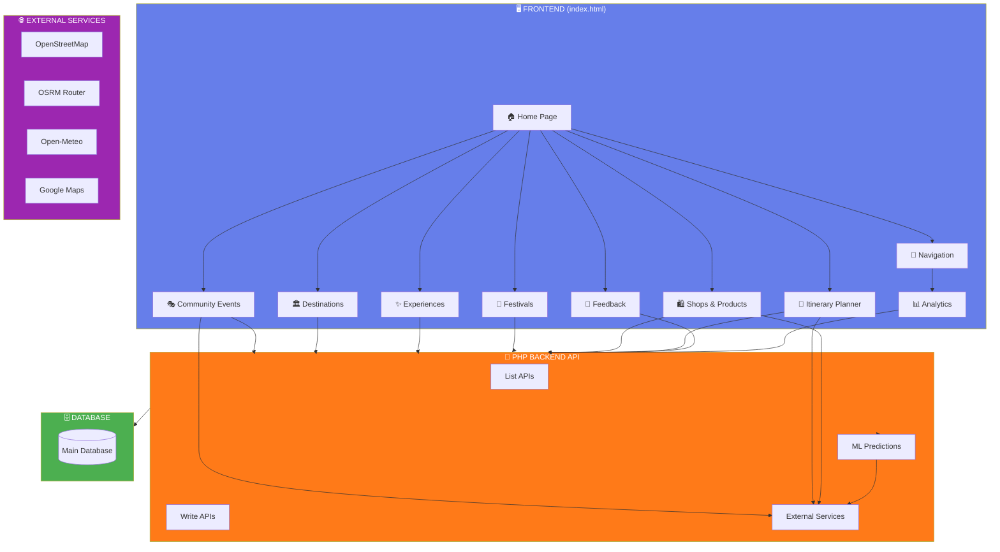

---

## Frontend Package Structure

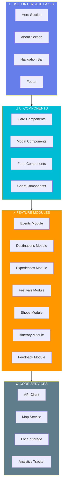

---

## Feature 1: Community Events

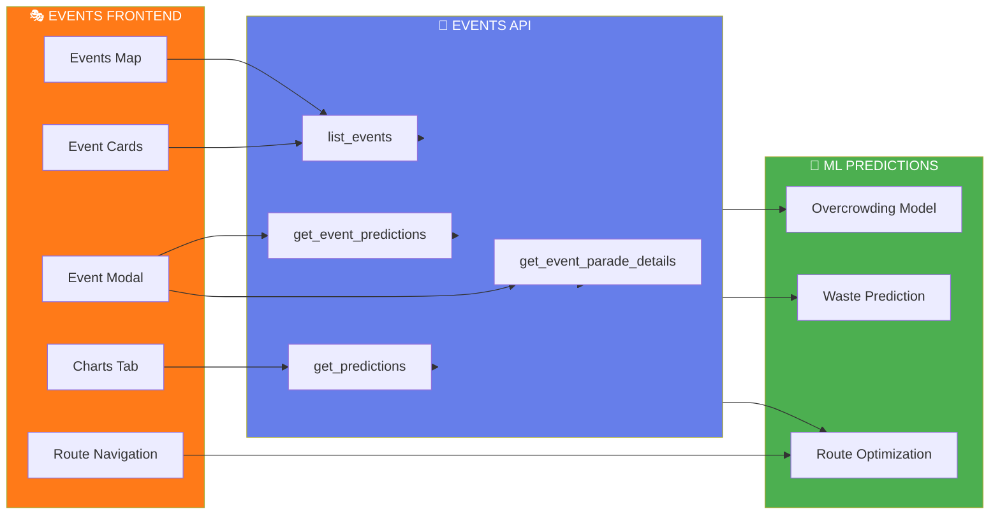

---

## Feature 2: Destinations

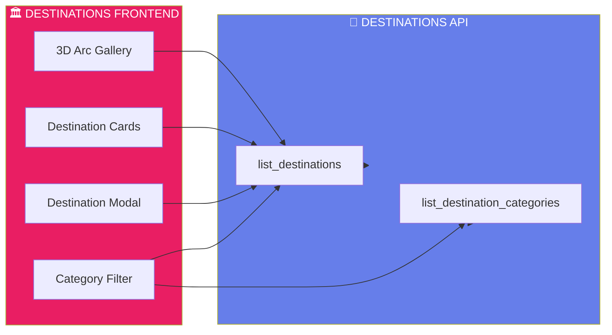

---

## Feature 3: Experiences

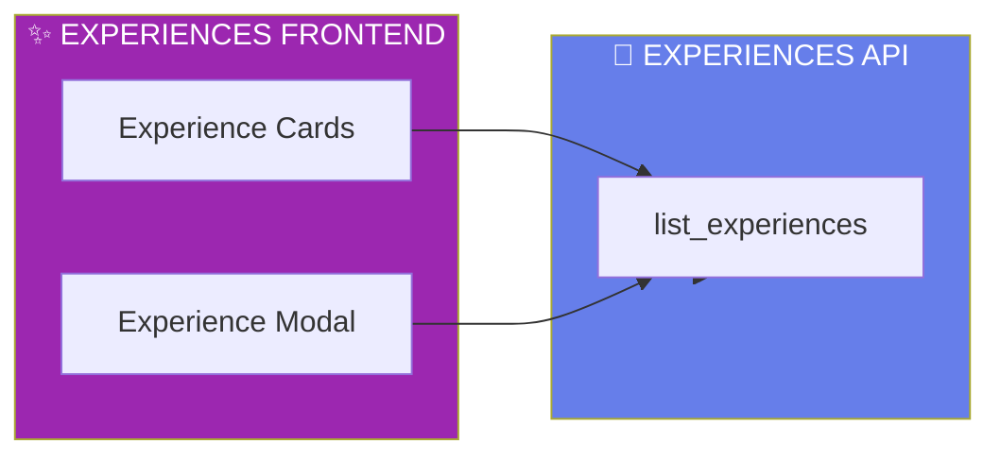

---

## Feature 4: Festivals

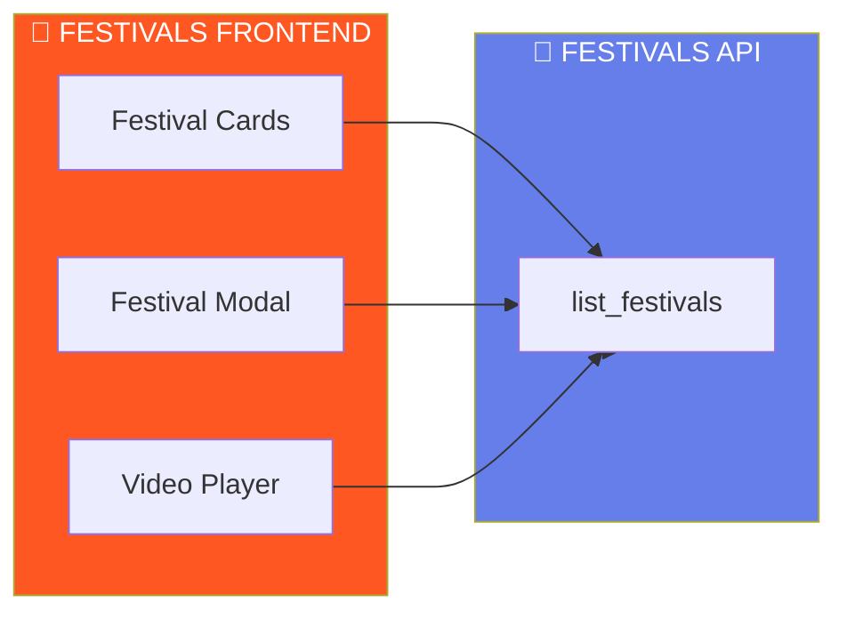

---

## Feature 5: Shops & Products

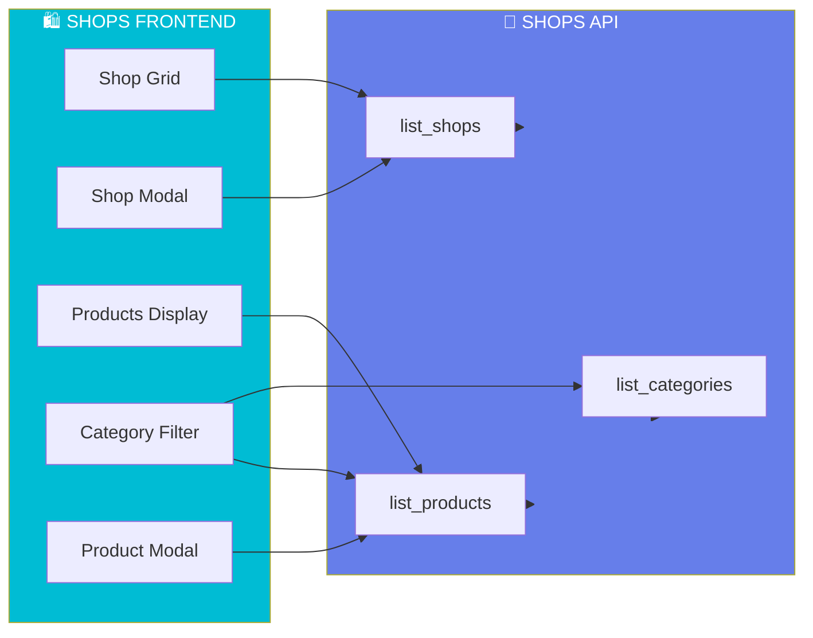

---

## Feature 6: Itinerary Planner

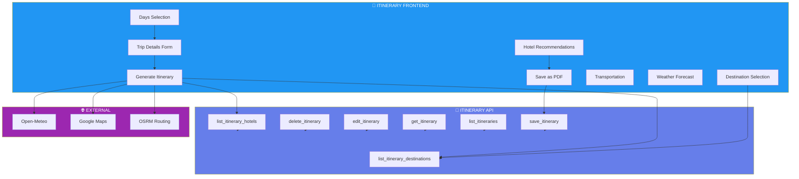

---

## Feature 7: Feedback Submission

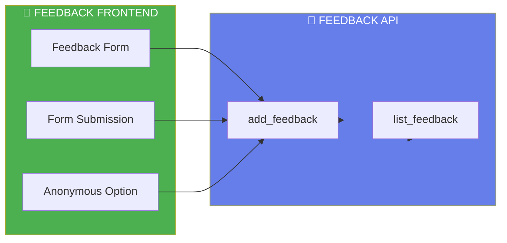

---

## Guest API Endpoints

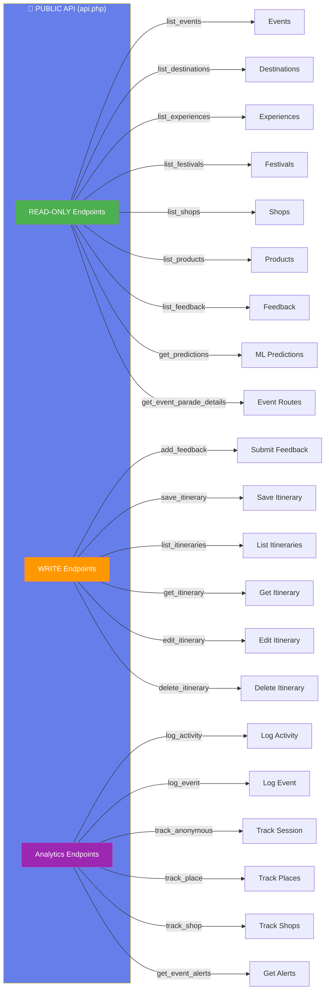

---

## Database Tables (Guest Access)

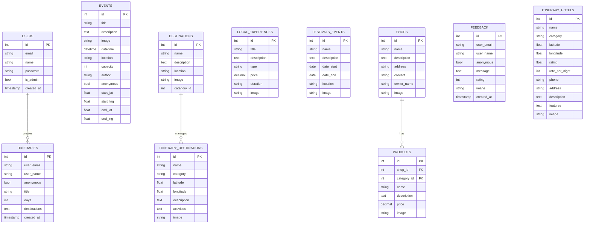

---

## Guest Data Flow

```mermaid
sequenceDiagram
    participant User
    participant Frontend
    participant API
    participant Database
    participant ML
    participant External
    
    User->>Frontend: Opens homepage
    Frontend->>API: GET list_events
    API->>Database: SELECT events
    Database-->>API: events data
    API-->>Frontend: events JSON
    Frontend->>ML: GET predictions
    ML-->>Frontend: prediction data
    
    par Parallel Loading
        Frontend->>API: GET list_destinations
        Frontend->>API: GET list_experiences
        Frontend->>API: GET list_festivals
        Frontend->>API: GET list_shops
    end
    
    Note over Frontend: User browses content<br/>and views details
    
    User->>Frontend: Plans itinerary
    Frontend->>API: GET list_itinerary_hotels
    Frontend->>External: GET weather forecast
    Frontend->>External: GET route suggestions
    
    User->>Frontend: Submits feedback
    Frontend->>API: POST add_feedback
    API->>Database: INSERT feedback
    
    User->>Frontend: Saves itinerary
    Frontend->>API: POST save_itinerary
    API->>Database: INSERT itinerary
    
    User->>Frontend: Downloads PDF
    Frontend->>Frontend: Generate PDF (html2pdf)
    Frontend-->>User: Download PDF
    
    Note over Frontend: Analytics tracked silently
    
    par Background Analytics
        Frontend->>API: POST log_event
        Frontend->>API: POST track_place
        Frontend->>API: POST track_shop
    end
    
    style User fill:#4caf50,color:#fff
    style Frontend fill:#667eea,color:#fff
    style API fill:#ff7a18,color:#fff
    style Database fill:#4caf50,color:#fff
    style ML fill:#9c27b0,color:#fff
    style External fill:#00bcd4,color:#fff
```

---

## File Structure (Guest Side)

```
frontend/
├── index.html                    # Main guest-facing page
├── script.js                     # Guest JavaScript logic
├── style.css                     # Styling
├── .htaccess                     # URL routing
│
├── legazpi_boundary.geojson     # City boundary data
│
├── assets/                      # Static assets
│   ├── logo.png
│   ├── hero.png
│   └── ...
│
├── img/                         # Images
│   └── uploads/                 # Mirrored uploads
│
backend/
├── api.php                      # Main API (guest + admin)
├── submit_feedback.php          # Feedback handler
├── event_predictions_api.php    # Event predictions
├── predictions_api.php          # Legacy predictions
├── db.php                       # Database connection
│
├── upload_feedback_image.php   # Feedback image upload
│
backend/ml/
├── server.js                    # ML prediction server
├── train.js                    # Model training
├── package.json                 # Node dependencies
│
docs/
├── GUEST_PACKAGE_DIAGRAM.md    # This document
├── GUEST_SEQUENCE_DIAGRAM.md   # Guest sequence diagrams
├── ADMIN_PACKAGE_DIAGRAM.md    # Admin package diagram
└── PACKAGE_DIAGRAM.md          # Complete system diagram
```

---

## Guest Session & Analytics Flow

```mermaid
sequenceDiagram
    participant User
    participant Frontend
    participant Analytics
    
    User->>Frontend: First visit
    Frontend->>Frontend: Generate session ID
    Frontend->>Frontend: Set cookie (anon_sid)
    
    par Tracking
        Frontend->>Analytics: POST log_event (page_view)
        Analytics->>Analytics: Store in anonymous_sessions
    end
    
    Note over Frontend: User browses pages
    
    par Continuous Tracking
        Frontend->>Analytics: Click events
        Frontend->>Analytics: Place views
        Frontend->>Analytics: Shop interactions
    end
    
    par Heartbeat
        Frontend->>Analytics: Every 30 seconds
        Analytics->>Analytics: Update session duration
    end
    
    Note over Frontend: User leaves
    
    par Exit Tracking
        Frontend->>Analytics: Page unload event
        Analytics->>Analytics: Log final duration
    end
    
    style User fill:#4caf50,color:#fff
    style Frontend fill:#667eea,color:#fff
    style Analytics fill:#9c27b0,color:#fff
```

---

## Guest Feature Comparison

| Feature | Description | Data Source | Authentication |
|---------|-------------|-------------|----------------|
| Community Events | View events with ML predictions | API (list_events, get_predictions) | None |
| Destinations | Browse tourist spots | API (list_destinations) | None |
| Experiences | Browse local activities | API (list_experiences) | None |
| Festivals | View festival events | API (list_festivals) | None |
| Shops & Products | Browse shops and products | API (list_shops, list_products) | None |
| Itinerary Planner | Plan trips with hotels & weather | API + External APIs | Optional |
| Feedback | Submit feedback | API (add_feedback) | Optional |
| Analytics | Anonymous session tracking | API (log_event) | None |

---

## External Services Used by Guests

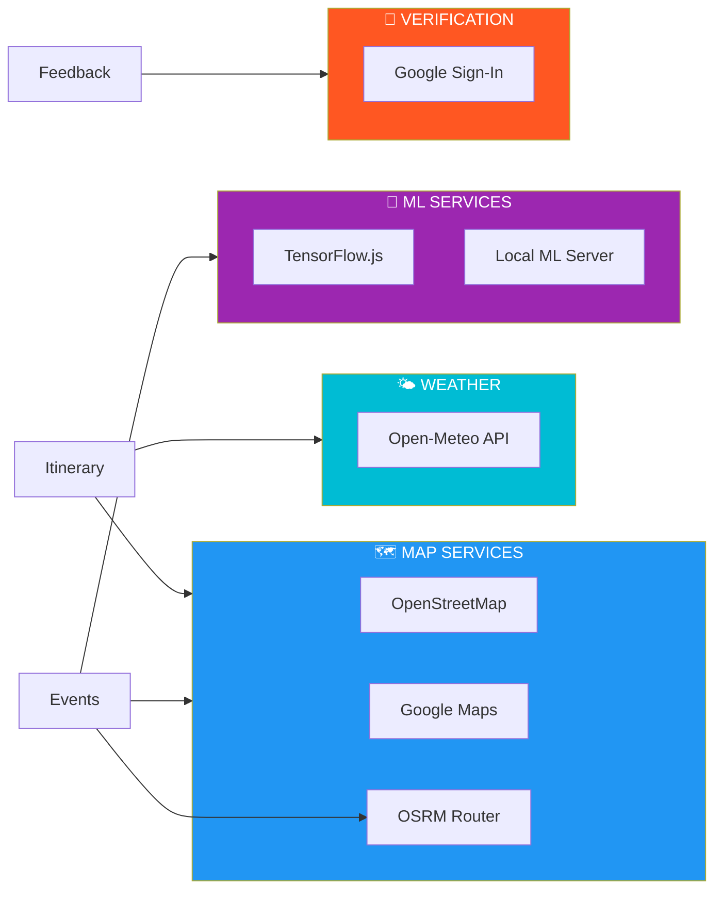

---

## Error Handling for Guests

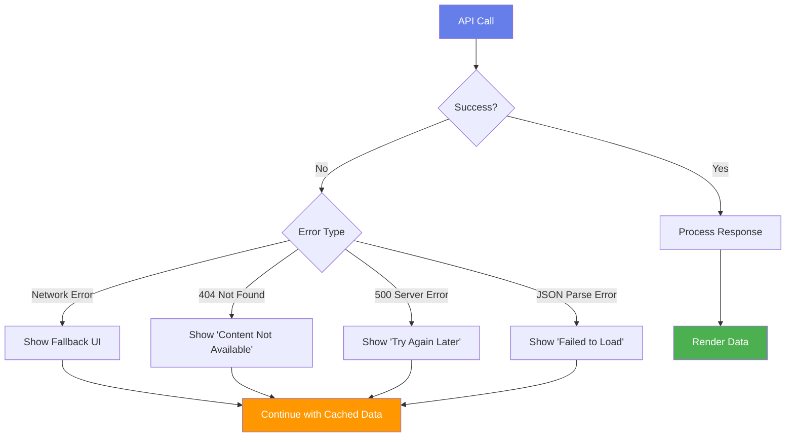

---

*Document Version: 1.0*
*Generated: 2026*
*Project: Legazpi Explorer - Capstone Project*

