# Guest Side Sequence Diagram - Legazpi Explorer

This document contains the Mermaid diagram for ALL guest/user side features of the Legazpi Explorer tourism management system.

---

## Complete Guest Features Overview

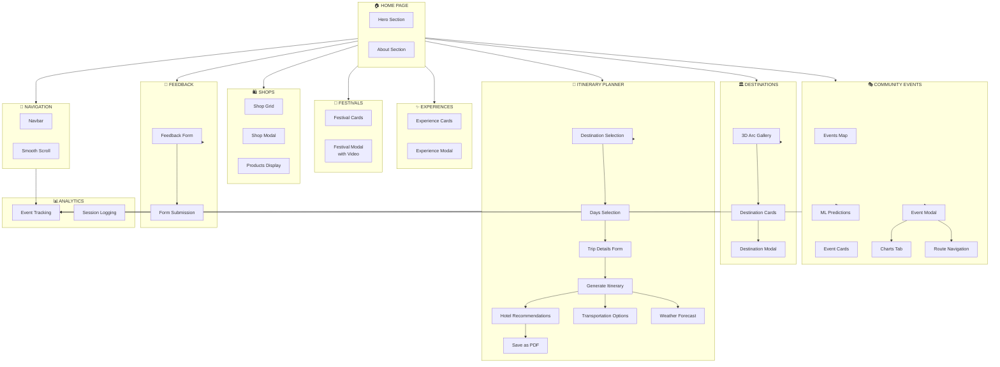

---

## Feature 1: Community Events with ML Predictions

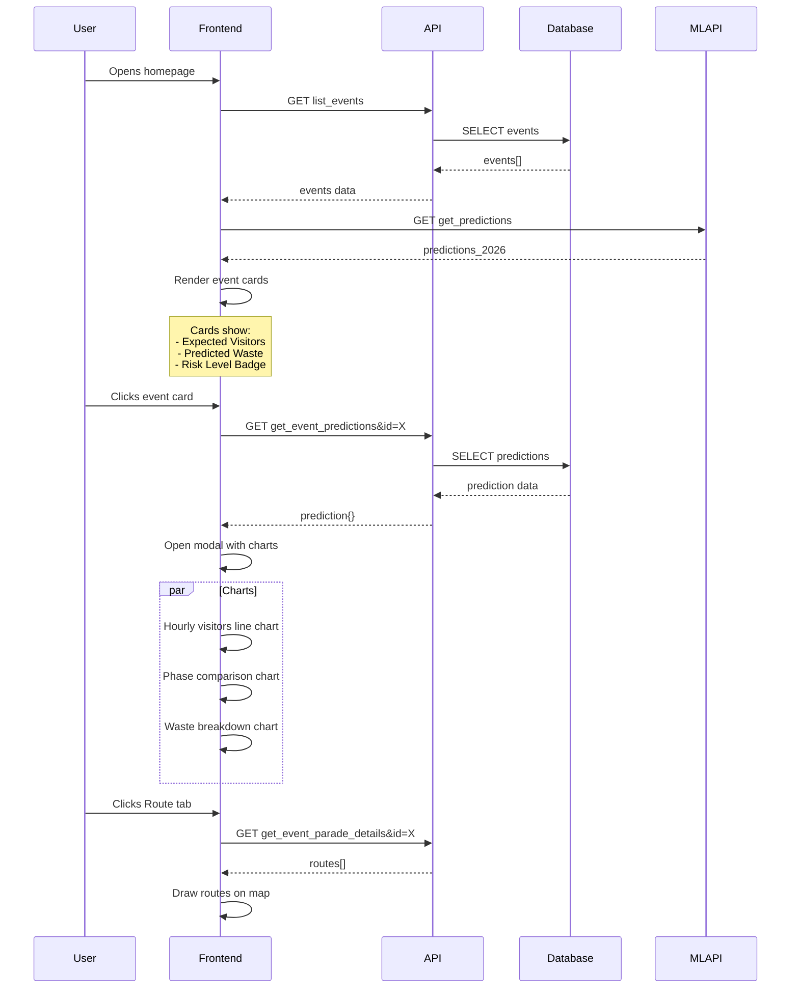

---

## Feature 2: Destinations Gallery

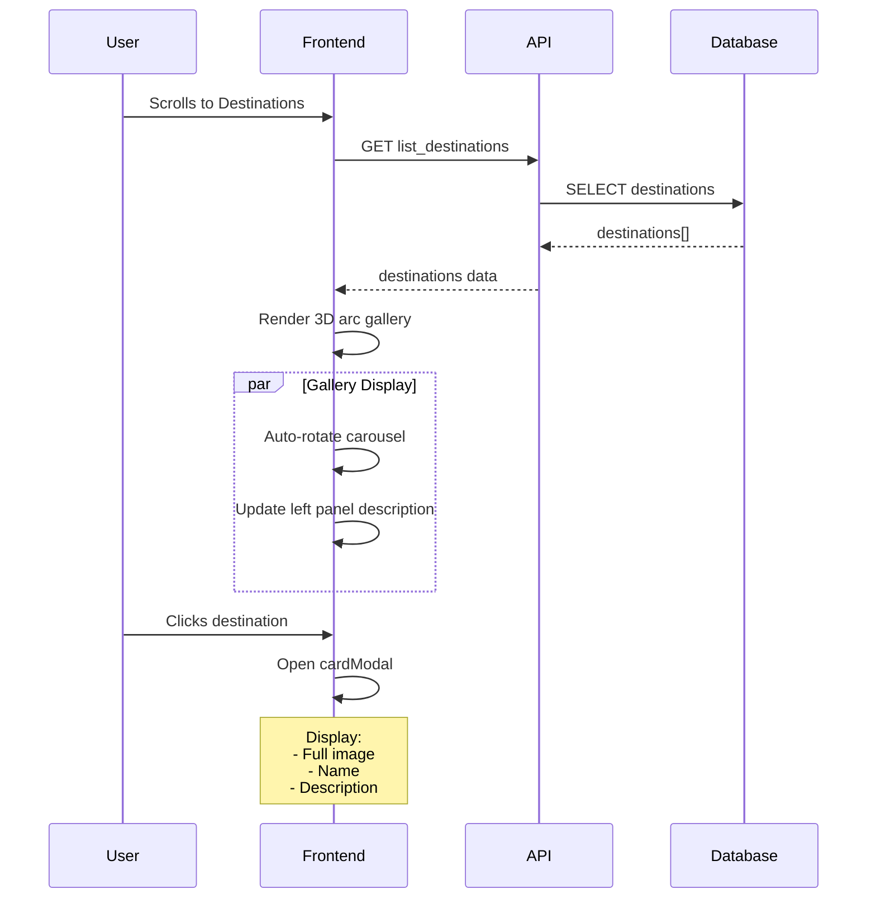

---

## Feature 3: Experiences

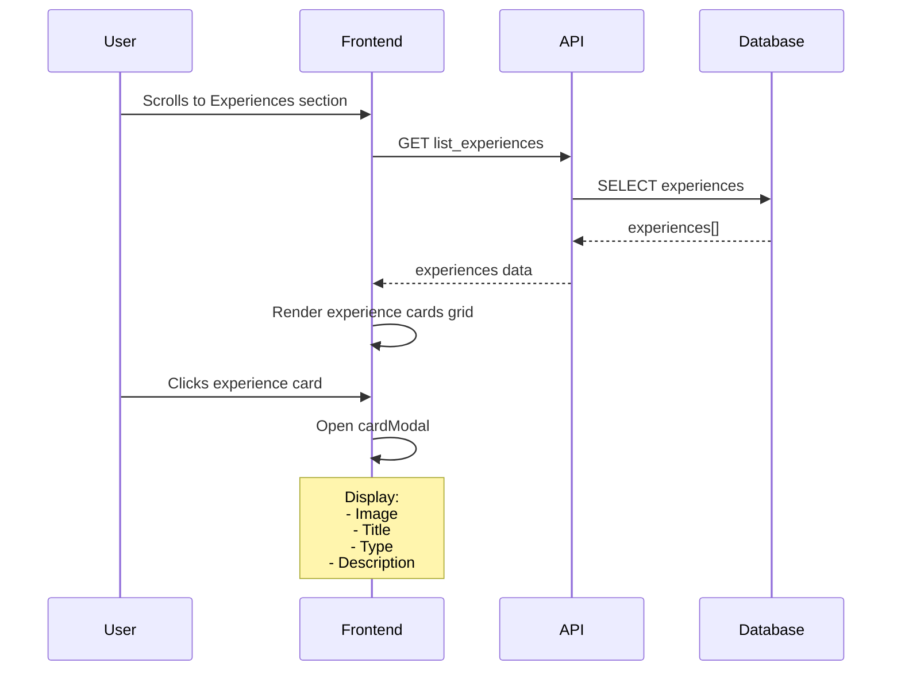

---

## Feature 4: Festivals

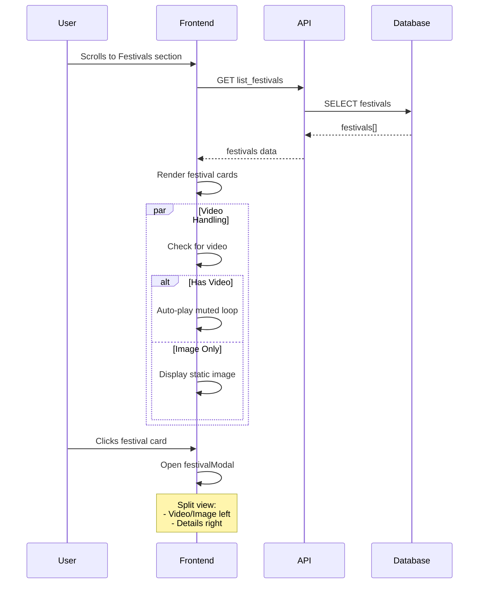

---

## Feature 5: Shops & Products

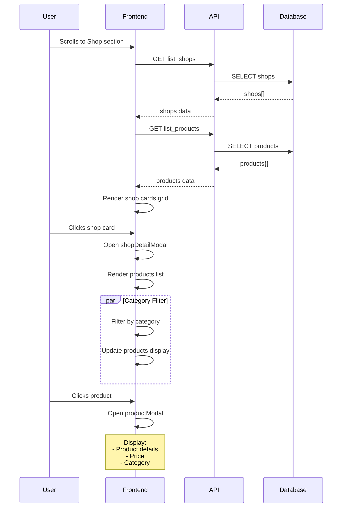

---

## Feature 6: Itinerary Planning

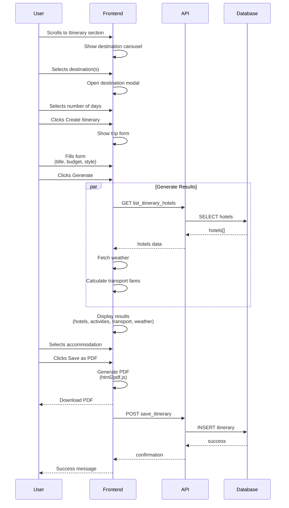

---

## Feature 7: Feedback Submission

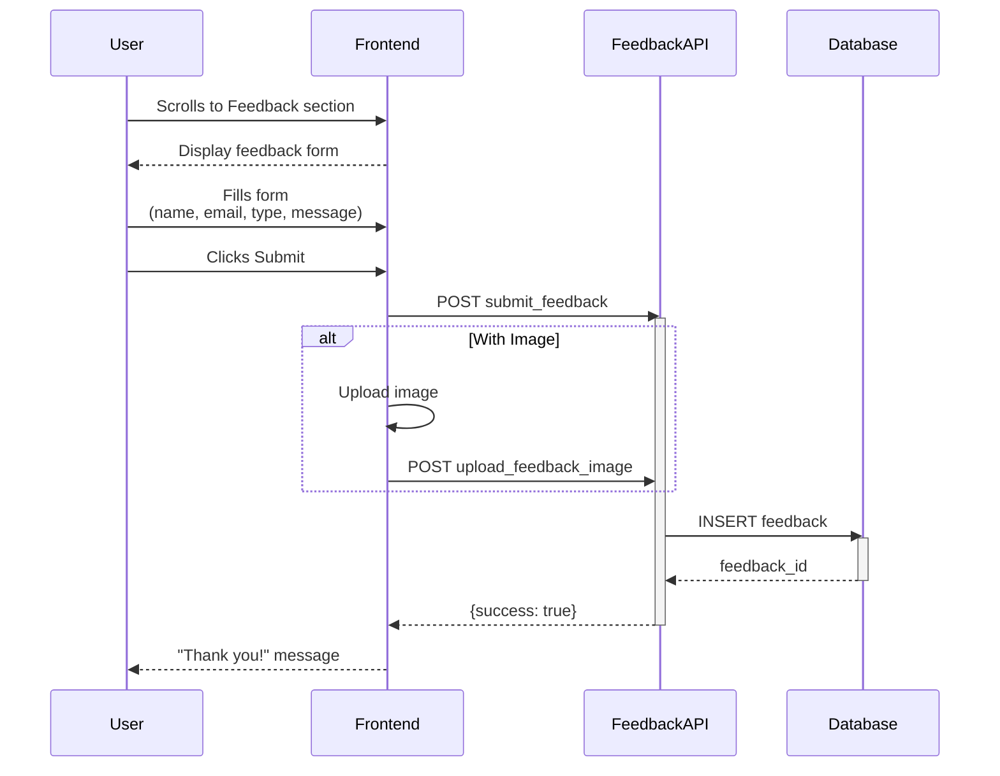

---

## Feature 8: Navigation & Analytics

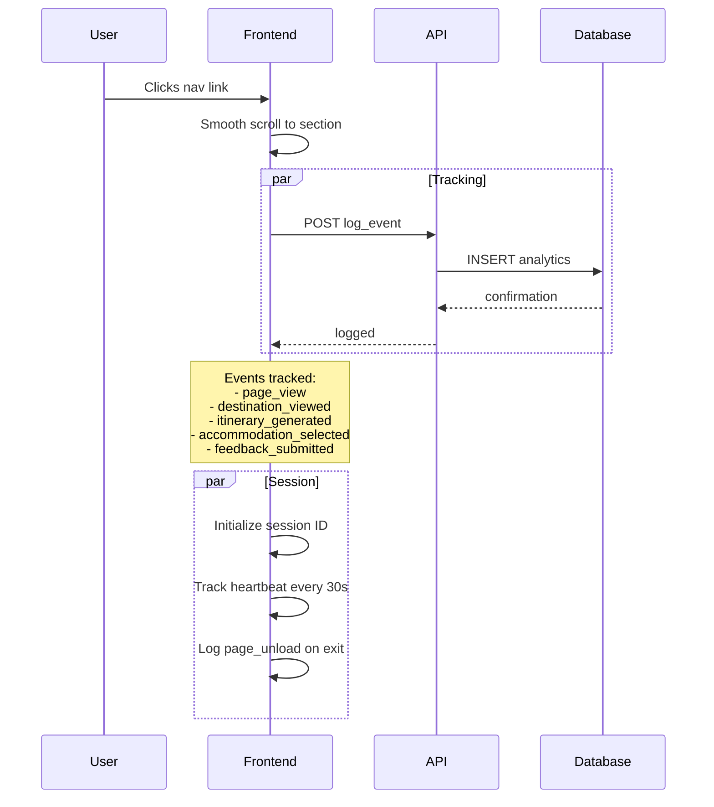

---

## Feature 9: Geolocation & Weather

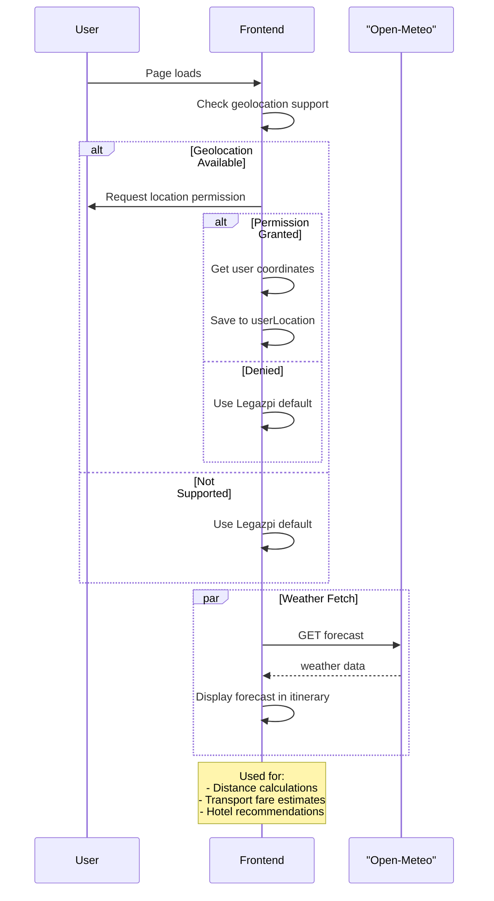

---

## API Endpoints Used by Guests

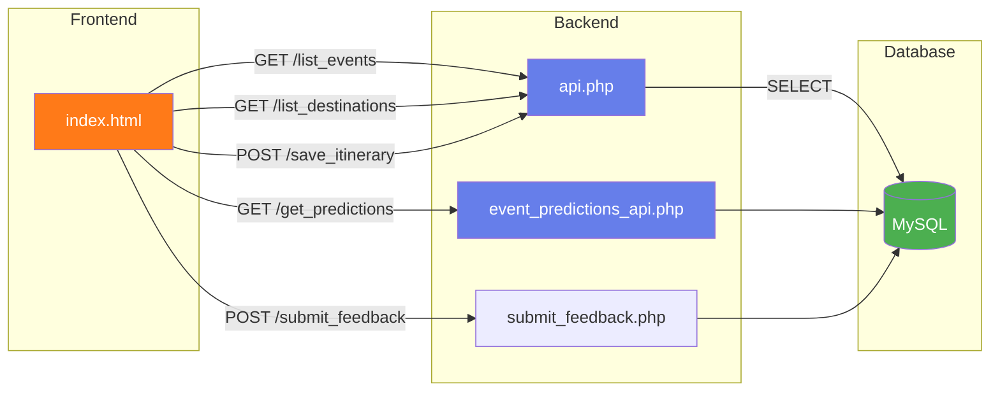

---

## Error Handling Flow

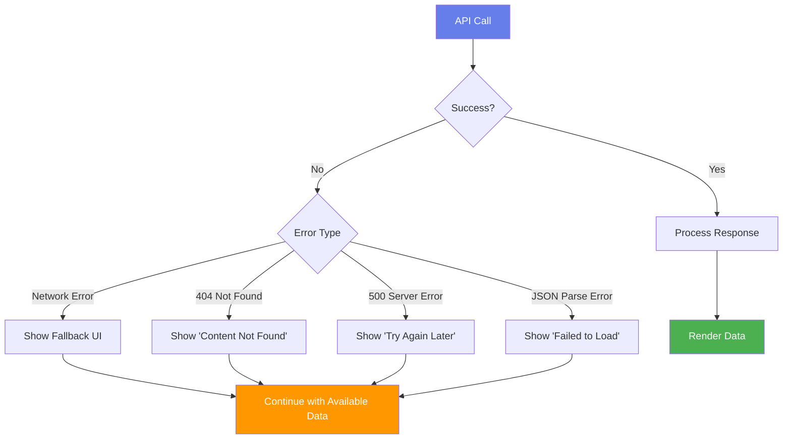

---

*Document Version: 1.0*
*Generated: 2026*
*Project: Legazpi Explorer - Capstone Project*

